# 目录 {.unnumbered}

| 章次 | 章节名称 | 页码 |
|---:|---|---:|
| 1 | 编制说明 | 4 |
| 2 | 摘要 | 6 |
| 3 | 执行摘要 | 8 |
| 4 | 技术目标与科学问题 | 11 |
| 5 | 研究边界、评价体系与证据等级 | 13 |
| 6 | 数据基础与力学代理模型 | 16 |
| 7 | 代理模型的外部验证 | 28 |
| 8 | 强化学习问题建模 | 42 |
| 9 | DDQN、经验回放与优化实现 | 44 |
| 10 | 异步训练架构与工程治理 | 45 |
| 11 | 训练探索历程 | 48 |
| 12 | 最新长训练配置与分析口径 | 58 |
| 13 | 最新长训练：训练侧结果 | 60 |
| 14 | 最新长训练：优化稳定性 | 66 |
| 15 | 最新长训练：固定验证结果 | 71 |
| 16 | 优先经验回放诊断 | 75 |
| 17 | 结果综合分析与问题定位 | 77 |
| 18 | 阶段结论 | 80 |
| 19 | 下一阶段研究方案 | 81 |
| 20 | 风险管理与质量保证 | 83 |
| 21 | 附录A：核心数学定义 | 84 |
| 22 | 附录B：关键结果汇总 | 85 |
| 23 | 附录C：固定验证对象 | 88 |
| 24 | 附录D：代码模块与职责 | 89 |
| 25 | 附录E：实验报告最小模板 | 91 |
| 26 | 附录F：术语表 | 92 |
| 27 | 附录G：证据来源与审计说明 | 93 |

```{=openxml}
<w:p><w:r><w:br w:type="page"/></w:r></w:p>
```

# 编制说明

## 报告目的

本报告面向“强化学习增强蛋白力学性能”科研课题的阶段复盘与下一阶段技术决策。报告不是单纯的代码说明，也不以展示单次最好曲线为目的，而是围绕四个问题组织证据：当前系统实际优化的技术目标是什么；目标如何被模型和奖励函数实现；为获得有效策略已经开展了哪些训练探索；现有结果能支持什么结论、不能支持什么结论，以及下一阶段应如何以最小成本排除关键不确定性。

项目名称沿用“力学性能增强”，但现有终端奖励主要由蛋白结构中的氢键数量、几何、序列远程性和接触拓扑等特征构成。因而，本阶段可操作的优化对象更准确地表述为“氢键介导的粘附/内聚潜力代理”，其与单分子拉伸强度、断裂韧性、宏观材料强度和界面粘附之间仍隔有结构预测误差、加载路径、聚集态组织及跨尺度映射等环节。报告在全文中坚持这一边界，避免将代理分数直接等同于实验力学性能。

## 数据来源与统计截止

报告依据当前代码仓库全部相关代码、`weekly/` 周报、`record/` 修改记录、模型评估产物及训练输出形成。当前长训练仍在运行，本版定量分析冻结于 **2026年8月28日20:33（UTC+8）**：固定验证编号至 769，共 770 次；验证触发时全局环境步至 4,429,856；训练汇总按前 184,000 条完整日志统计；优化器分析截断至全局步 4,432,416。后续日志不应与本报告数值直接拼接，需在新版快照中重新计算。

所有“现状”判断遵循如下证据优先级：固定样本、固定随机种子、$\epsilon=0$ 的贪婪验证，高于带探索噪声的训练回报；训练终局指标高于批次优化量；优化损失、Q值和吞吐率只用于判断数值与工程状态，不能替代目标有效性验证。

## 版本结论声明

截至统计截止点，项目已经完成从环境、代理奖励、DDQN、经验回放到异步训练和独立验证的闭环，训练数值稳定性及吞吐能力得到显著改善；但固定验证集的平均终端奖励仍为负，770 次验证中没有一次“均值置信区间显著为正”，因此尚不能声称已获得可稳定提升目标性能的策略。当前成果的主要价值，是建立了可复现的研究基础设施，明确了代理目标的适用边界，并将失败模式从“程序/数值不可用”收敛到“目标对齐、可识别性和探索效率不足”。

```{=openxml}
<w:p><w:r><w:br w:type="page"/></w:r></w:p>
```

# 摘要

本项目构建了一个面向蛋白质序列定点突变的强化学习系统。智能体以 ESM2 每残基表征和已访问位点掩码为状态，以“残基位置×20种氨基酸”为离散动作，通过 PyRosetta 完成突变与局部侧链重排，并用局部构象约束、氢键变化和随机森林力学代理共同构造奖励。训练算法采用双重深度Q网络（Double DQN），结合动作合法性掩码、目标网络、优先经验回放、三步回报、异步多执行器采样和独立贪婪验证。

代理模型基于 7 个序列长度及氢键拓扑特征拟合 SMD 数据中的 toughness（`v127`）和 strength（`v128`）。随机划分测试集上，toughness 和 strength 的决定系数分别为 0.657 和 0.302，Spearman 等级相关分别为 0.890 和 0.832；相似性划分后性能下降，且特征重要性中序列长度占 0.694，说明模型具有排序能力，但仍存在长度混杂和分布外可靠性限制。CATH 结构替换评估表明，使用预测结构时绝对拟合显著下降，而排序相关仍有一定保留。MechanoPro 单分子力和蜘蛛丝宏观材料指标上的直接外推相关为弱负值，进一步说明现有代理不能直接解释为实验拉伸力或材料强韧性。

训练方面，项目先后处理了回合跨度过长、终端奖励稀释、正偏置步奖励导致Q值虚高、半精度非有限值、串行吞吐受限、孤儿进程和验证污染等问题。最新配置采用 24 步回合、零中心步奖励、终端奖励放大 8 倍、PER 与 $n=3$ 回报，并以 24 个 CPU actor、3 个 ESM2 GPU worker 和 1 个学习器组成异步流水线。在早期对比中，异步 A12 相对串行 F8/G1 获得约 2.83 倍原始步吞吐；actor 扩展实验显示 A24 在吞吐与回合时延之间较优。

最新长训练的训练行为策略由第0轮平均终端奖励 -0.546 改善至第22轮 -0.239，主要来自 toughness 分量“少负化”；但独立固定验证最后50次平均终端奖励仍为 -0.497，最佳25次滑动均值仍为 -0.268，且后期存在回退。优先回放确实提高了终端样本可见性，但优先级最高1%的样本中终端转移比例为 78.4%、终端正样本率仅 11.4%，表明学习器主要在反复吸收大幅负向失败。由此判断，下一阶段不应继续单纯扩大训练步数，而应先完成目标校准、正向可达性检查、长度与结构不确定性控制，以及受约束候选生成的小规模闭环验证。

**关键词：** 蛋白质设计；氢键网络；粘附/内聚潜力；力学代理；Double DQN；优先经验回放；异步强化学习。

```{=openxml}
<w:p><w:r><w:br w:type="page"/></w:r></w:p>
```

# 执行摘要

## 技术状态判定

本阶段可用“工程闭环已形成、代理边界已识别、策略有效性尚未通过”概括。

| 评价维度 | 当前状态 | 主要证据 | 判定 |
|---|---|---|---|
| 数据与代理 | 已建立可运行的双目标代理 | 随机测试集 Spearman 0.890/0.832 | 具备域内排序能力 |
| 分布外效度 | 尚不足 | MechanoPro、蜘蛛丝直接相关弱负 | 不能等同实验性能 |
| 环境闭环 | 已完成 | 突变、局部重排、掩码、奖励、终止均可测试 | 工程可用 |
| 学习数值 | 当前稳定 | 最近1万更新 loss 均值 0.0052，Q均值 0.253 | 已消除主要数值故障 |
| 训练趋势 | 有“少负化” | 第0至第22训练轮终端均值 -0.546→-0.239 | 有学习迹象但带行为偏差 |
| 固定验证 | 未通过 | 最佳25次滑动均值 -0.268；显著为正次数0 | 尚无稳定正向策略 |
| 工程吞吐 | 已明显提升 | 异步相对串行原始吞吐约2.83倍 | 足以支持对照实验 |
| 候选交付 | 不具备条件 | 代理外推与验证均未通过门槛 | 暂不建议进入实验候选阶段 |

## 三项核心结论

第一，**“力学性能”在当前实现中不是一个直接实验量，而是以氢键网络为主的结构代理。** 将其改称“氢键介导粘附/内聚潜力”能够更准确地指导算法评价；但该名称仍代表机制假设，而非已经完成的宏观粘附验证。

第二，**现有训练已经从数值不稳定转变为目标有效性问题。** 当前 Q 值、梯度、TD误差和损失均保持在稳定量级，异步链路和进程生命周期也得到治理。继续以调学习率、增 actor 或延长训练为主，边际收益有限；决定性瓶颈是代理分数是否提供了可学习、可达、可外推的方向。

第三，**训练回报改善不能替代固定验证。** 训练数据由 $\epsilon$-greedy 行为策略、不断变化的策略版本和 PER 抽样共同产生，存在选择偏差。固定验证中平均终端奖励始终为负，且强度分量几乎无随训练时间改善的线性趋势，因此不能从训练轮均值推导“模型已经学会增强力学性能”。

## 建议的近期决策

建议暂停无对照的超长续训，采用“先判可达、再判可学、最后判外推”的三级门槛：首先用穷举/启发式单点扫描估计16个固定蛋白上正奖励动作的密度和上界；其次在去除长度混杂并加入代理不确定性的奖励下进行短程多种子对照；最后仅对通过固定验证且跨结构稳健的候选开展更高保真结构松弛或SMD复核。若任一层未通过，应回到奖励或数据建模，而不是增加训练预算。

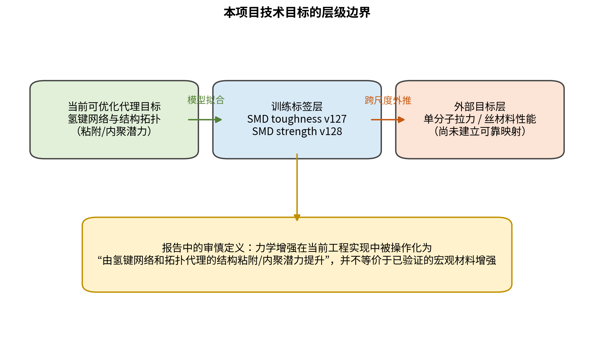{width=16.0cm}

图1是全文解释口径的基础：终端奖励能够衡量的是由特定结构和特定特征计算出的代理变化；“粘附/内聚”是对氢键机制的工作性解释；实验单分子力与宏观材料性能只能作为外部校准对象，不能反向替代当前训练标签。

```{=openxml}
<w:p><w:r><w:br w:type="page"/></w:r></w:p>
```

# 技术目标与科学问题

## 原始任务及其可操作化

原始任务是通过序列设计增强蛋白质力学性能。若直接以实验断裂力、韧性或界面粘附功作为奖励，需要对每个中间突变体实施高成本分子动力学或实验测量，无法支持百万级环境交互。本项目因此引入廉价代理：从蛋白三维结构提取氢键及拓扑特征，用随机森林预测 SMD 标签，再将初态与终态预测差作为终端奖励。

设初始结构的两个标准化代理为 $z_{s,0}$ 和 $z_{t,0}$，回合结束结构为 $z_{s,T}$ 和 $z_{t,T}$，最新终端奖励写为：

$$
R_{terminal}=8\times\frac{(z_{s,T}-z_{s,0})+(z_{t,T}-z_{t,0})}{2}.
$$

其中 $s$ 表示 strength，$t$ 表示 toughness。该定义消除了不同量纲的直接相加问题，也使奖励关注回合内变化而非蛋白之间的绝对基线差异。但它仍继承了代理模型的全部偏差：序列长度影响、结构预测误差、训练数据分布边界及两个标签的物理定义。

## 从“力学”到“粘附/内聚”的解释

氢键能够贡献局部稳定、链内协同和跨链界面作用，因此在某些体系中与内聚强度或粘附行为有关；但氢键数量并不单调决定力学性能。键的方向性、受力方向、串并联拓扑、溶剂暴露、竞争配位、二级结构协同以及疏水和静电作用均可能改变宏观响应。当前7维代理包含非局部键比例、骨架—骨架非局部键密度和接触序等信息，已经比“数氢键”更接近网络拓扑，但仍无法完整表达加载路径。

因此，本报告采用三级术语：代码层称“strength/toughness 代理”；机制层称“氢键介导粘附/内聚潜力”；实验层保留“单分子力、韧性或材料性能”。只有在跨域对照通过后，才允许把机制层结果升级为实验层结论。

## 关键科学问题

本项目当前需要回答的不是“Q网络是否足够大”，而是以下四个递进问题：

1. **目标可测性：** 7维氢键特征能否稳定地从突变后结构计算，且对结构预测或局部重排误差不过度敏感？
2. **目标可达性：** 在24次不可重复位点突变和局部重排约束下，固定蛋白是否存在足够密度的正向轨迹？
3. **目标可学性：** ESM2状态与局部动作是否包含预测奖励变化所需的信息，DDQN能否从稀疏终局信号中识别正向动作？
4. **目标外推性：** 代理提升是否能够在高保真SMD、单分子拉伸或材料指标上保留方向？

四者不能倒置。若可达性为零，增加探索不会产生有效样本；若代理外推性不足，训练成功也只会优化模型漏洞。

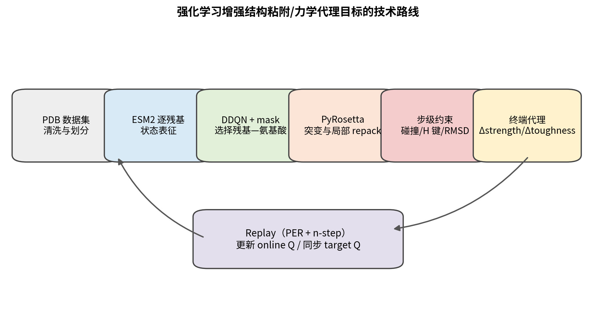{width=16.0cm}

图2将数据建模、环境交互、价值学习和独立验证串联起来。虚线反馈体现本阶段最重要的认识：验证失败可能要求返回代理目标层，而非只在强化学习层调参。

```{=openxml}
<w:p><w:r><w:br w:type="page"/></w:r></w:p>
```

# 研究边界、评价体系与证据等级

## 当前研究边界

本报告覆盖：单链蛋白结构上的序列突变、PyRosetta 局部重排、基于结构氢键特征的双目标随机森林、DDQN训练、异步系统、固定验证和已有外部数据对照。报告不覆盖显式界面复合物设计、溶剂化自由能计算、完整拉伸路径模拟、材料纺丝工艺或湿度等环境因素。

“粘附”一词仅在氢键介导机制的工作假设下使用。如果未来目标是严格的界面粘附，应将状态扩展为界面双方结构，将奖励改为跨界面氢键、界面面积、解离自由能或拉脱功，并设置界面专属实验标注。当前单链内氢键更直接对应内聚/结构稳定潜力。

## 指标分层

评价指标分为四层。第一层为任务指标：固定验证的终端奖励、strength 与 toughness 的标准化变化、正样本比例和跨蛋白一致性。第二层为学习指标：TD误差、Q值、目标Q、梯度范数和损失。第三层为采样指标：终端样本比例、PER优先级构成、探索率和回放覆盖。第四层为工程指标：环境步吞吐、回合时延、队列等待、GPU利用和进程健康。

只有第一层可以判定策略是否有效；第二至第四层用于解释第一层。损失下降而终端奖励为负，说明网络可能更准确地拟合负回报；吞吐提升只说明更快地产生数据。

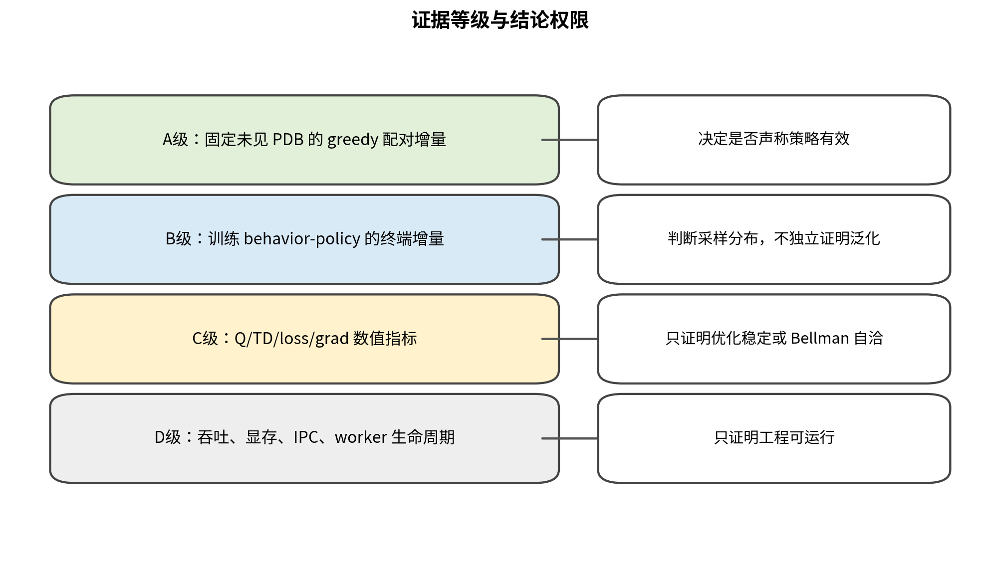{width=16.0cm}

图3给出报告的判读规则。固定验证使用相同16个PDB、固定种子、冻结策略快照和 $\epsilon=0$，避免探索率、样本难度和回放分布随时间变化造成的假改善。

```{=openxml}
<w:p><w:r><w:br w:type="page"/></w:r></w:p>
```

## 阶段门槛

为避免“持续训练即持续进展”的叙事，本报告定义五级门槛：代理域内验证、正向动作可达性、固定验证转正、多随机种子复现、外部高保真复核。当前已经通过工程可运行和部分域内排序验证，但尚未通过固定验证转正。

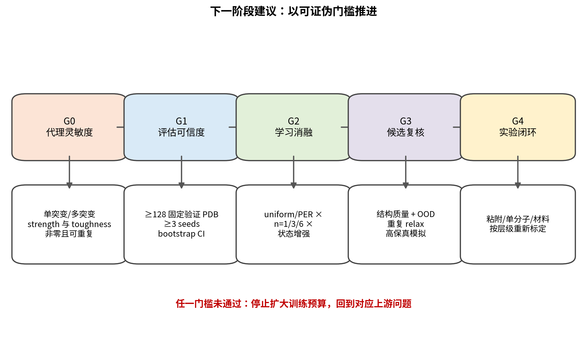{width=16.0cm}

图4中每一门槛均对应“继续/返回”的明确动作。其意义是将计算预算投入到最能减少不确定性的实验，而不是在尚未证明可达时扩大长训练。

```{=openxml}
<w:p><w:r><w:br w:type="page"/></w:r></w:p>
```

# 数据基础与力学代理模型

## 训练标签及分布

代理模型的监督标签来源于已有 SMD 数据，使用 `v127` 表示 toughness、`v128` 表示 strength。数据呈现明显偏态，训练分析中使用 `log1p` 等变换观察分布。偏态意味着均方误差容易由少量极端值主导，也使随机划分可能把相近家族或长度相近样本同时分到训练集和测试集，从而高估泛化。

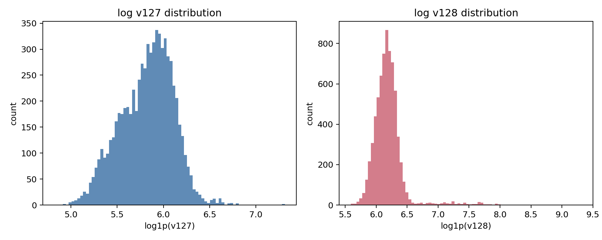{width=15.8cm}

图5显示两个目标均非对称高斯分布。评价时除 $R^2$ 外保留 Spearman 等级相关，是因为强化学习更关心候选排序方向，但等级相关高也不能弥补绝对尺度不准。

```{=openxml}
<w:p><w:r><w:br w:type="page"/></w:r></w:p>
```

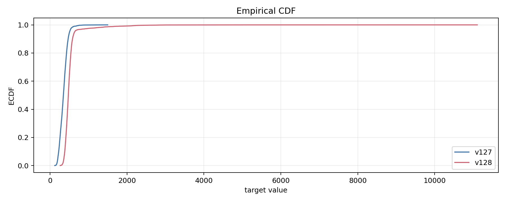{width=15.8cm}

图6进一步显示样本集中区与长尾区。未来划分固定验证集时，应同时按长度、结构类别和标签分位数分层，防止验证结果被少数高值蛋白支配。

```{=openxml}
<w:p><w:r><w:br w:type="page"/></w:r></w:p>
```

## 序列长度混杂

序列长度既影响可形成氢键的绝对数量，也与数据集中的结构域类型和SMD指标相关。若模型主要依赖长度，则对固定长度的单点突变几乎不给出可用方向；更严重的是，在长度分布变化的外部数据上会产生系统偏差。

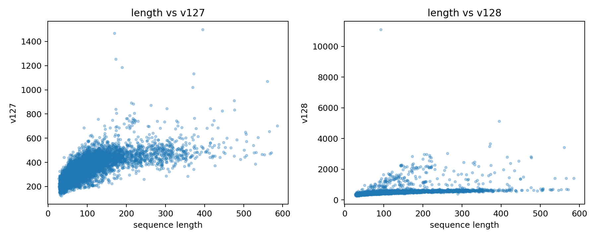{width=15.8cm}

图7提示长度是必须显式控制的混杂变量。项目后续使用“每残基”归一化、长度消融和偏相关分析，但目前最终模型的重要性仍由长度主导，说明问题尚未彻底解决。

```{=openxml}
<w:p><w:r><w:br w:type="page"/></w:r></w:p>
```

## 七维氢键特征

当前随机森林输入为：序列长度、每残基氢键数、每残基序列非局部氢键数、强非局部氢键比例、每残基强非局部氢键数、每残基非局部骨架—骨架氢键数以及氢键接触序。各特征试图分别表达规模、密度、跨序列距离、几何强度与拓扑跨度。

特征计算对突变后结构执行，并由模型工件统一保存特征顺序、标准化及两输出模型，避免训练和在线奖励中的列错位。终端奖励比较回合初始与最终 PyRosetta pose；早期把静态源预测结构混入差分的做法已移除，以避免“结构来源差异”被误当成“突变效果”。

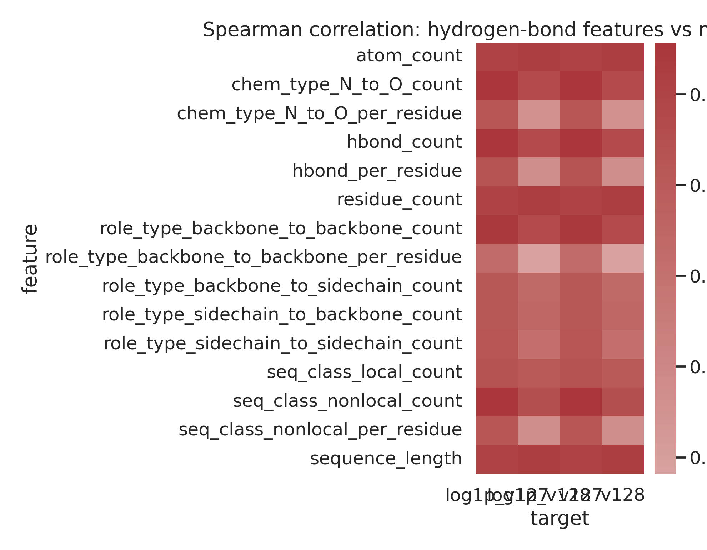{width=15.8cm}

图8说明多个氢键密度和拓扑特征彼此相关。随机森林可以拟合非线性，但相关特征会分摊重要性，因此单一重要性值只宜用于风险提示，不应当作机制因果证据。

```{=openxml}
<w:p><w:r><w:br w:type="page"/></w:r></w:p>
```

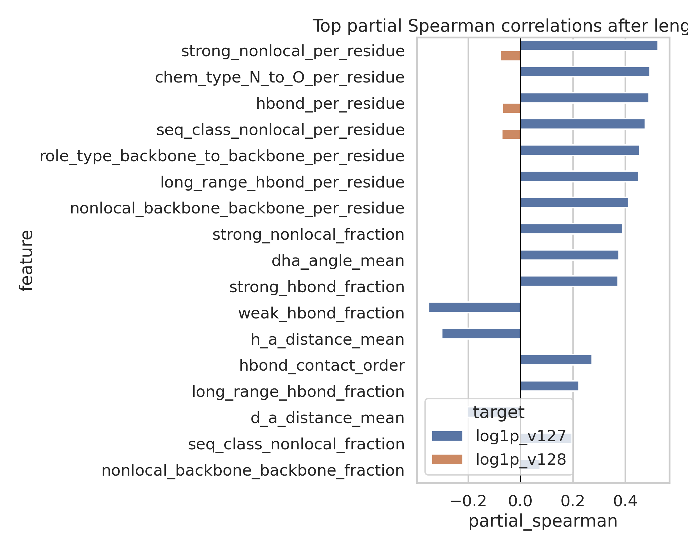{width=15.8cm}

图9用于判断氢键信息是否超越“蛋白越长、键越多”的平凡关系。部分特征在控制长度后仍保留信号，为继续研究提供依据；但偏相关不能证明在突变局部邻域中也具有相同单调性。

```{=openxml}
<w:p><w:r><w:br w:type="page"/></w:r></w:p>
```

## 域内预测性能

随机划分得到训练/验证/测试样本数 5,632/704/705。测试集上，toughness 的 $R^2=0.657$、Spearman $=0.890$；strength 的 $R^2=0.302$、Spearman $=0.832$。说明模型更擅长排序而非精确回归，且 toughness 比 strength 更易拟合。

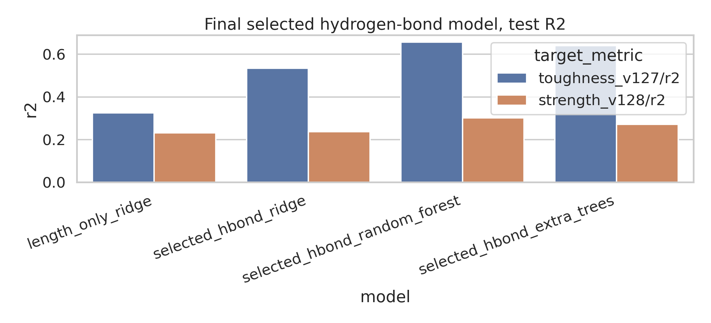{width=15.8cm}

图10揭示两个输出头的难度不对称。把两者等权加入终端奖励，会让噪声较大的 strength 分量对动作排序产生额外扰动；后续应报告分头置信度，或按可校准性而非主观同权设置权重。

```{=openxml}
<w:p><w:r><w:br w:type="page"/></w:r></w:p>
```

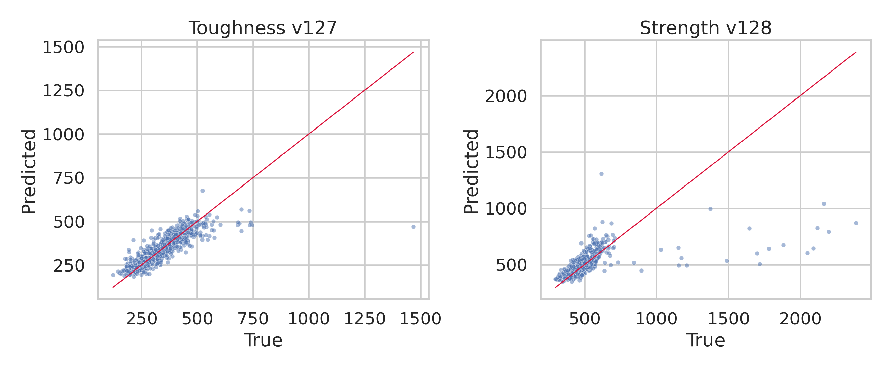{width=15.8cm}

图11可见极端区间误差更大。强化学习反复优化一个回归模型时，容易主动搜索其误差较大的边界区域，即“代理利用”。因此候选排序需要代理不确定性惩罚及适用域检测，而不能只取最高预测值。

```{=openxml}
<w:p><w:r><w:br w:type="page"/></w:r></w:p>
```

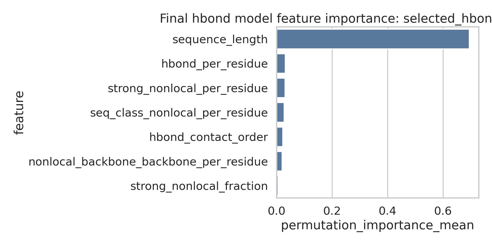{width=15.8cm}

图12中序列长度的重要性约为 0.694，其余单项氢键特征约为 0.005—0.031。尽管树模型重要性受变量尺度和相关性影响，该结果仍是高优先级风险：在固定长度突变任务中，模型可利用的动态信号只来自其余较弱特征。

```{=openxml}
<w:p><w:r><w:br w:type="page"/></w:r></w:p>
```

## 划分稳健性与长度消融

采用相似性划分后，所选随机森林在测试集上的 toughness $R^2=0.631$、strength $R^2=0.221$，Spearman 分别为 0.884 和 0.812；两目标平均 $R^2$ 相较随机划分下降约 0.0557。下降幅度不是灾难性，但证明随机划分存在乐观成分。

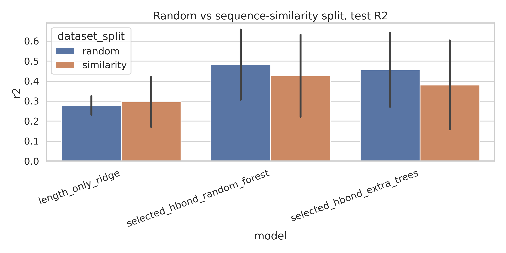{width=15.8cm}

图13支持把结构/序列相似性隔离作为后续标准，而非仅报告随机拆分。强化学习固定验证也应避免与代理训练数据高度同源。

```{=openxml}
<w:p><w:r><w:br w:type="page"/></w:r></w:p>
```

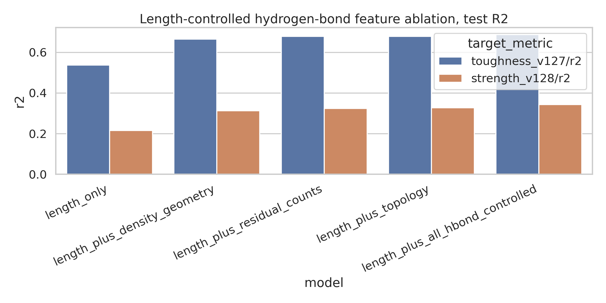{width=15.8cm}

控制长度后，全氢键模型相较仅长度模型，toughness 和 strength 的 $R^2$ 分别提升约 0.150 和 0.127，说明氢键特征确实提供增量信息。与此同时，长度主导的重要性说明“有增量信息”和“足以驱动局部突变优化”是两个不同命题。

```{=openxml}
<w:p><w:r><w:br w:type="page"/></w:r></w:p>
```

## 氢键几何信号

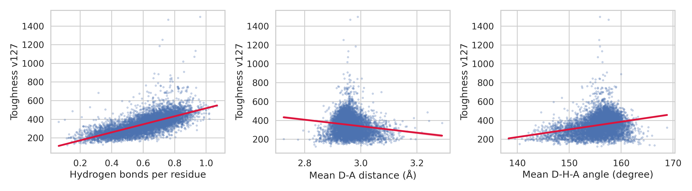{width=15.8cm}

图15展示几何与拓扑特征在 toughness 标签上的总体关系。散点离散性意味着单个局部动作的奖励差可能接近模型噪声，必须用重复结构重排或不确定性估计判断小变化是否可信。

```{=openxml}
<w:p><w:r><w:br w:type="page"/></w:r></w:p>
```

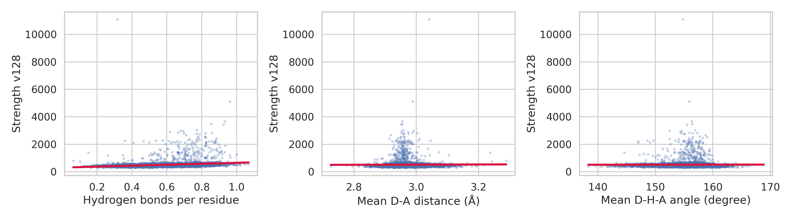{width=15.8cm}

图16与较低的 strength $R^2$ 一致。后续不宜继续默认双目标等权；可先以置信度较高的 toughness 做可学性验证，再用约束或多目标 Pareto 方式逐步引入 strength。

```{=openxml}
<w:p><w:r><w:br w:type="page"/></w:r></w:p>
```

# 代理模型的外部验证

## CATH 结构替换测试

CATH 测试集含 705 个样本。以参考结构计算特征时，模型与标签的 Spearman 相关约为 0.889（toughness）和 0.833（strength），与域内测试相近；使用 ColabFold 预测结构后，$R^2$ 降至约 0.019 和 0.051，但 Spearman 仍约为 0.743 和 0.817。这表明结构预测误差显著影响绝对数值，而部分排序信息仍能保留。

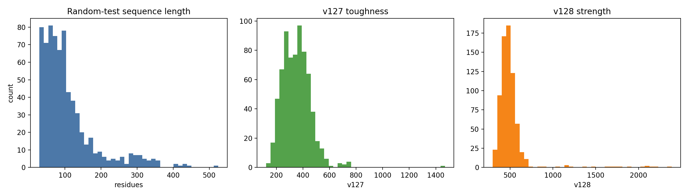{width=15.8cm}

图17用于确认样本长度和目标覆盖范围。外部验证的价值不只是再报告一个平均分，而是量化从参考结构到预测结构这一实际部署链路的误差传播。

```{=openxml}
<w:p><w:r><w:br w:type="page"/></w:r></w:p>
```

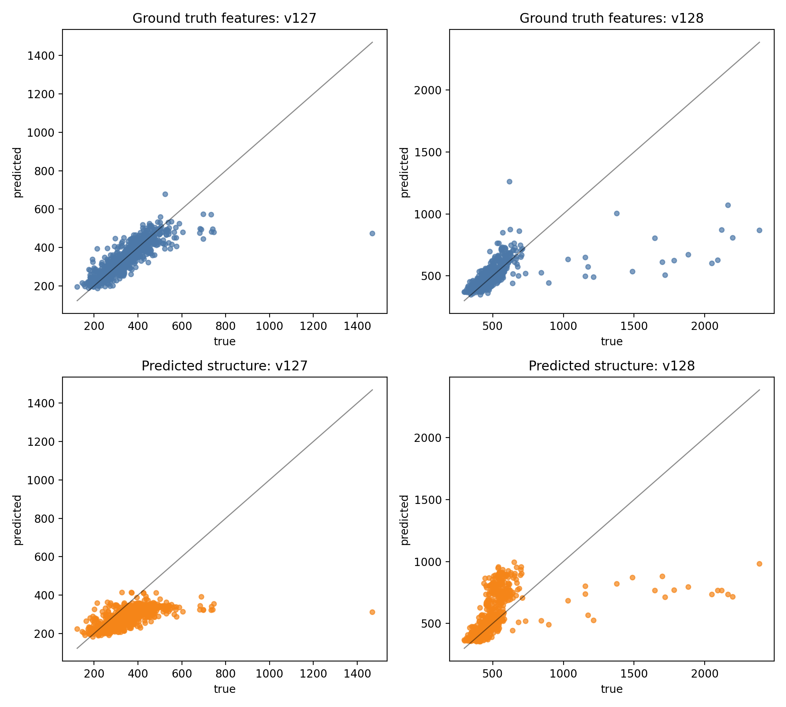{width=15.8cm}

图18表明“排序尚可、绝对值漂移”是主要现象。当前终端奖励是同一回合初末结构的差分，可部分抵消固定偏置，但若突变前后结构误差异方差，差分仍会被噪声放大。

```{=openxml}
<w:p><w:r><w:br w:type="page"/></w:r></w:p>
```

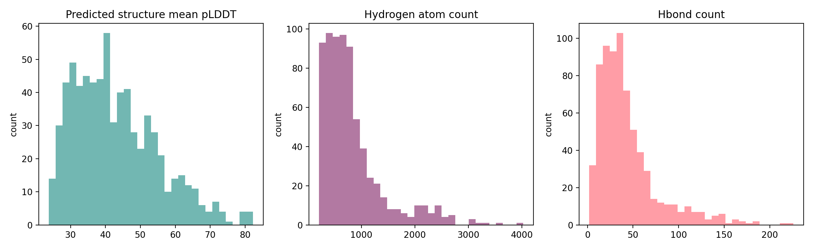{width=15.8cm}

图19提示应把结构质量纳入奖励置信度或候选筛选。对低置信区域给出高代理增益的突变，优先级应低于结构稳定且增益略小的突变。

```{=openxml}
<w:p><w:r><w:br w:type="page"/></w:r></w:p>
```

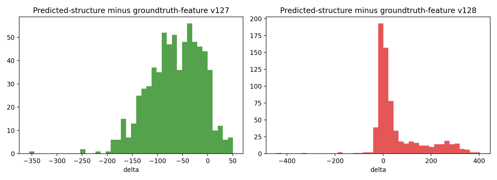{width=15.8cm}

图20显示结构来源本身足以引起明显分数变化。这也是训练代码后来统一初末 PyRosetta pose 来源的重要原因；否则终端奖励可能奖励“建模流程变化”而非“序列突变”。

```{=openxml}
<w:p><w:r><w:br w:type="page"/></w:r></w:p>
```

## MechanoPro 单分子力对照

MechanoPro 聚合后约有38个PDB条目。代理 toughness、strength 及其终端组合与实验力的 Spearman 相关约为 -0.374、-0.392 和 -0.387。样本量小、实验条件异质、重复记录处理方式和加载几何均会影响结果，但至少可以排除“当前代理与单分子力存在明显正向直接映射”的乐观假设。

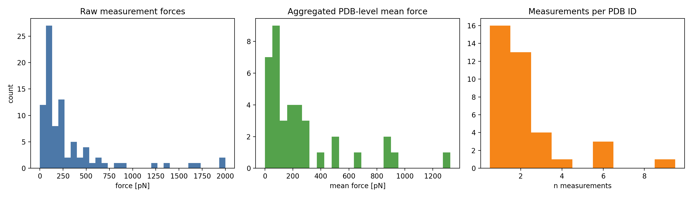{width=15.8cm}

图21说明同一结构可能对应不同实验值，聚合方式会改变相关估计。后续需要保留实验条件、拉伸端点、加载速度和结构构象，而非仅按PDB合并。

```{=openxml}
<w:p><w:r><w:br w:type="page"/></w:r></w:p>
```

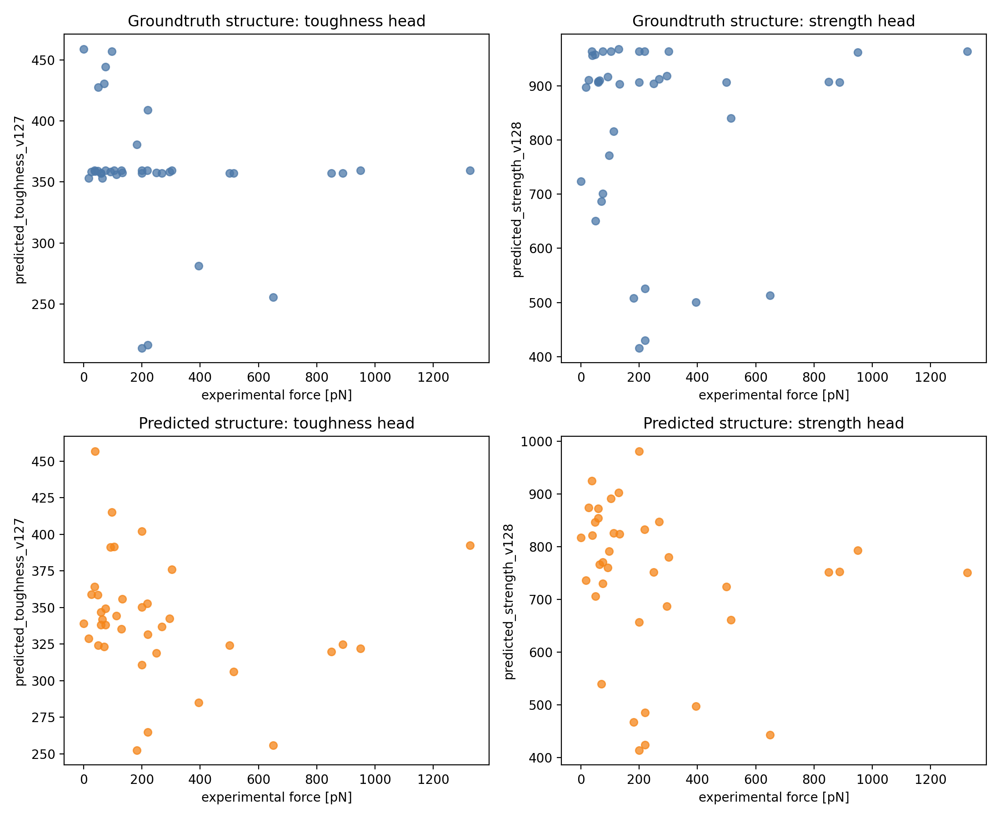{width=15.8cm}

图22中的弱负趋势不能解释为“增加氢键必然降低力学性能”；更合理的结论是两个量并非同一任务，且当前特征没有编码实验受力路径。该结果要求修正名称和评价边界，而非简单反转奖励符号。

```{=openxml}
<w:p><w:r><w:br w:type="page"/></w:r></w:p>
```

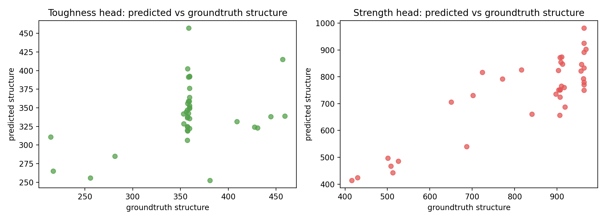{width=15.8cm}

图23用于分离结构来源误差和任务定义误差。即使参考结构上代理稳定，也不能自动获得与实验力的一致性；反之，预测结构不稳定会进一步降低在线优化可信度。

```{=openxml}
<w:p><w:r><w:br w:type="page"/></w:r></w:p>
```

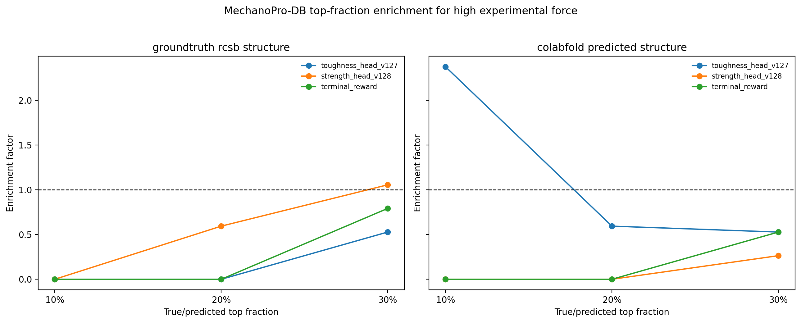{width=15.8cm}

图24检验模型是否至少能把实验高值富集到候选顶部。现有结果不足以建立稳定的 top-k 筛选价值，候选进入高成本验证前必须加入机制和适用域过滤。

```{=openxml}
<w:p><w:r><w:br w:type="page"/></w:r></w:p>
```

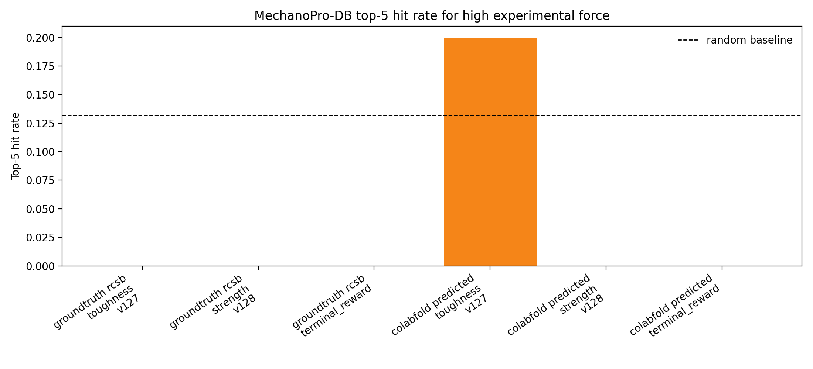{width=15.8cm}

图25强调评估不能只看总体相关。科研应用更关心有限预算下的命中率；当前证据尚不足以支持把代理最高分直接作为实验优先级。

```{=openxml}
<w:p><w:r><w:br w:type="page"/></w:r></w:p>
```

## 蜘蛛丝材料数据对照

蜘蛛丝数据含约203个物种/类群记录。按类型平衡后，材料 toughness 与代理 toughness 的 Spearman 约为 -0.138，材料 strength 与代理 strength 约为 -0.073，属于弱相关或无直接实用相关。终端奖励 Top 10% 对高 toughness 的富集约为1.38，但预测顶部样本的材料均值仍低于全局均值，不能据此宣称有效筛选。

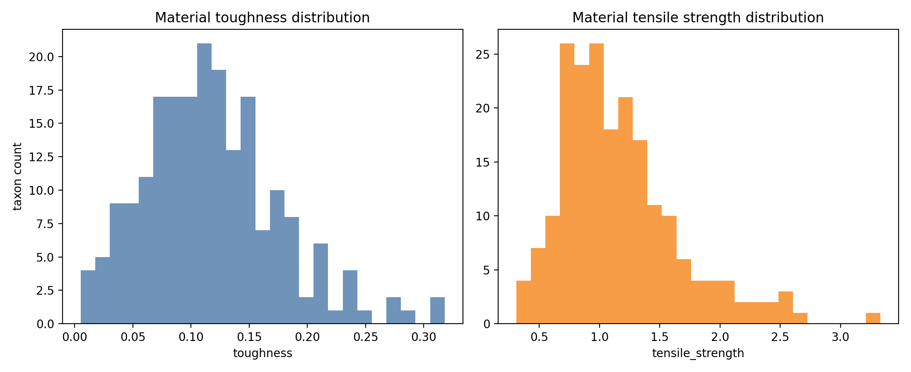{width=15.8cm}

图26反映不同丝类型的分布差异。物种、丝类型、蛋白重复区、纺丝过程和测试环境均可能造成混杂，因此类型平衡是最低要求，但不是充分校准。

```{=openxml}
<w:p><w:r><w:br w:type="page"/></w:r></w:p>
```

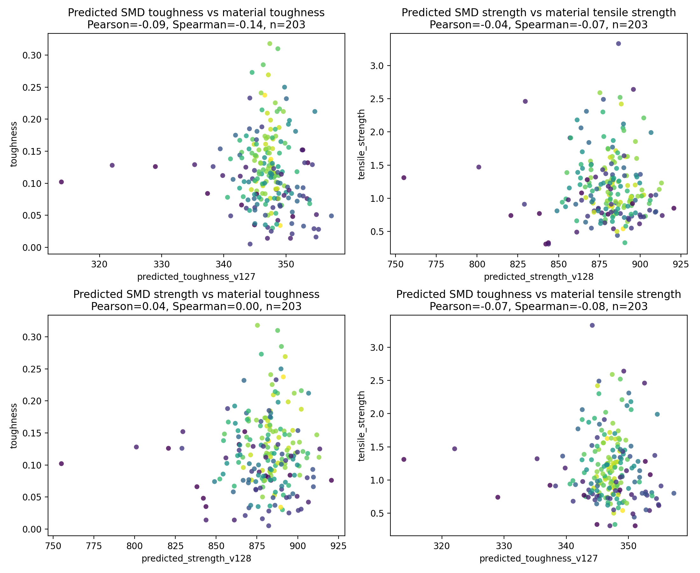{width=15.8cm}

图27说明单链结构的氢键代理不能直接跨越到纤维材料层。材料强度取决于多链组装、结晶区/无定形区比例、取向和加工历史，这些变量均不在当前状态中。

```{=openxml}
<w:p><w:r><w:br w:type="page"/></w:r></w:p>
```

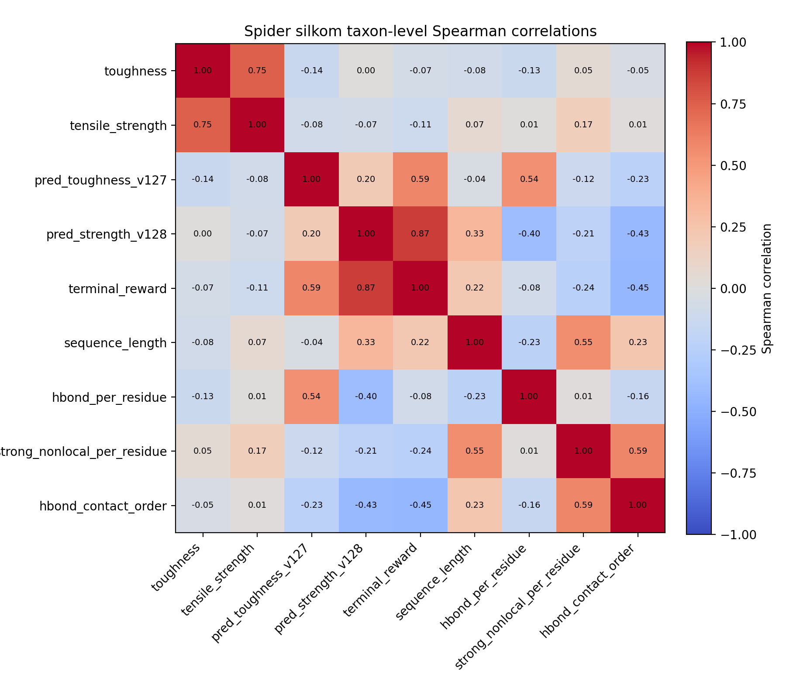{width=15.8cm}

图28提供跨尺度失配的整体证据。后续如以蜘蛛丝为目标，应建立材料专属模型和层级表示，而不是沿用当前SMD代理作为唯一终端目标。

```{=openxml}
<w:p><w:r><w:br w:type="page"/></w:r></w:p>
```

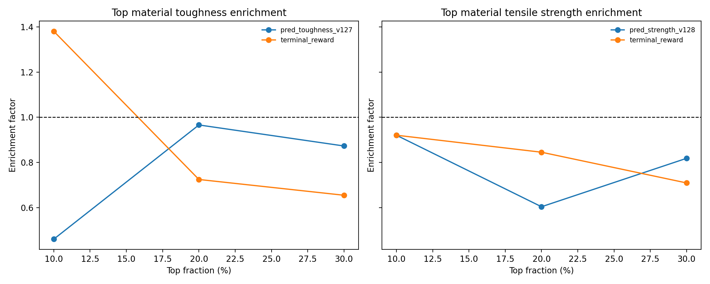{width=15.8cm}

图29提示局部阈值下可能出现偶然富集，但均值、趋势和稳定性不一致。在样本较小且分组众多时，应使用重采样置信区间和预先登记的筛选规则，防止事后挑选阈值。

```{=openxml}
<w:p><w:r><w:br w:type="page"/></w:r></w:p>
```

## 外部验证的综合判定

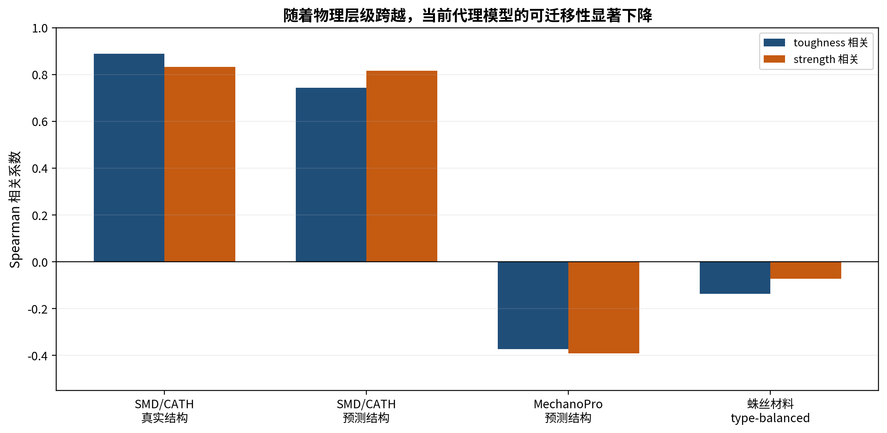{width=15.8cm}

图30把CATH结构替换、MechanoPro单分子力和蜘蛛丝材料性能置于同一图中。结论不是代理“完全无效”，而是其有效性目前主要限于原SMD标签和相近结构域；越过物理层级后缺少正相关证据。强化学习应先被定义为优化该代理的算法实验，所有实验力学声明须另设验证链。

```{=openxml}
<w:p><w:r><w:br w:type="page"/></w:r></w:p>
```

# 强化学习问题建模

## 马尔可夫决策过程

每个回合从一个蛋白结构开始。最新状态表示由 ESM2 的每残基 1,280 维嵌入与“该位点是否已经被修改”的1维掩码拼接，形成 $L\times1281$ 的变长状态。动作空间是 $L\times20$，即选择一个残基位置和目标氨基酸。与当前氨基酸相同的无操作动作、已经访问的位点和其他非法动作在选择及目标Q计算时均被掩码。

动作执行后，PyRosetta 完成残基替换和半径8 Å邻域的侧链重排。最新长训练不执行每步能量最小化，以控制成本和避免结构过度漂移。单回合最多24步，并启用 `prevent_revisit`，使轨迹表示不重复位点的组合突变。

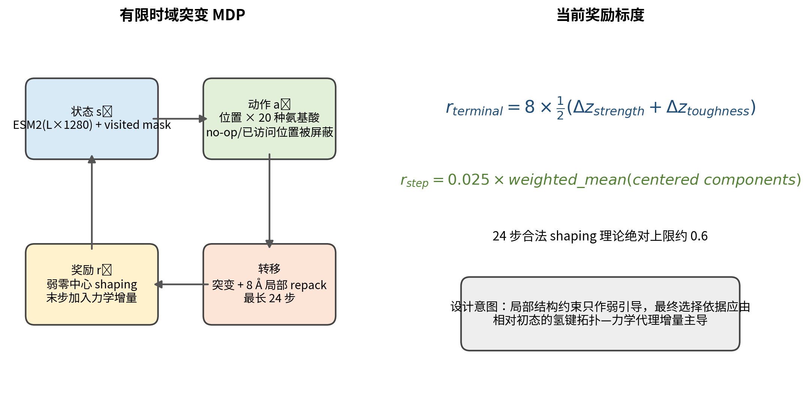{width=16.0cm}

图31显示两类奖励承担不同职责：步奖励约束每次突变的局部可接受性，终端奖励判断整条轨迹的代理目标变化。两者尺度必须匹配，否则智能体会学习“保持局部好看”而忽略最终目标。

```{=openxml}
<w:p><w:r><w:br w:type="page"/></w:r></w:p>
```

## 零中心步奖励

最新步奖励由碰撞、骨架氢键、侧链氢键和局部RMSD等分量加权构成，并缩放为 0.025。相较早期始终为正的基线，新设计围绕零点表达“相对可接受/不可接受”，减少智能体仅靠延长回合累计正奖励的机会。按当前权重，24步绝对累计量级约不超过0.6，使其与经8倍放大的终端奖励具有可比较尺度。

零中心不代表每项都必须均值为零。合理做法是用随机策略或无信息策略标定，使中性动作的总步奖励接近零，并监测不同蛋白长度、结构类别之间的偏置。如果同一动作在不同结构类别上产生系统性偏移，仍需按蛋白基线做标准化。

## 终端奖励与信用分配

早期回合最大长度达到1,024步，在 $\gamma=0.99$ 时，回合起点看到的终端权重仅约 $0.99^{1023}=3.4\times10^{-5}$；缩短为50步后约为0.611，24步后约为0.794。若均匀抽取128个转移，批次包含至少一个终端转移的近似概率由11.8%（1,024步）提升到92.5%（50步）和99.6%（24步）。因此缩短回合不是纯工程加速，而是改变任务可学习性的关键设计。

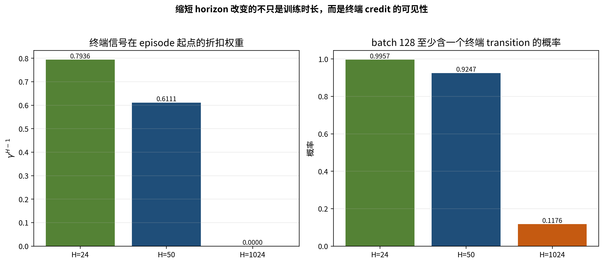{width=15.8cm}

图32解释了为何“终端奖励已经加入”不等于“网络能够学到终端奖励”。$n=3$ 回报和PER进一步提高终端信息传播，但如果正向终端轨迹本身稀少，这些机制也可能主要加速对失败的拟合。

```{=openxml}
<w:p><w:r><w:br w:type="page"/></w:r></w:p>
```

# DDQN、经验回放与优化实现

## 双重深度Q网络

在线网络输出每个位置—氨基酸动作的Q值；动作选择使用在线网络，动作评价使用目标网络，从而降低标准DQN的过估计偏差。下一状态的非法动作在 `argmax` 前被置为不可选，避免目标值来自实际上无法执行的动作。目标网络每125次优化同步，折扣因子为0.99，损失采用Huber形式，梯度范数裁剪阈值为10。

训练批量为128。最新运行采用FP32。此前FP16自动混合精度出现过非有限值；在未完成逐算子数值审计前，FP32的稳定收益高于半精度吞吐收益。

## 优先经验回放与三步回报

优先经验回放参数 $\alpha=0.6$，重要性采样修正 $\beta$ 从0.4逐渐增加到1。样本概率近似为

$$
P(i)=\frac{p_i^{\alpha}}{\sum_k p_k^{\alpha}},\qquad
w_i=\left(NP(i)\right)^{-\beta}.
$$

三步回报把后续三次奖励合并到当前目标，缩短终端信息传播路径。最新运行的回放容量为100,000；200,000容量尝试伴随更高内存压力及作业被 `SIGKILL` 的记录，但现有日志不足以把所有退出唯一归因于OOM，因此本报告仅把它列为高风险相关因素。

## 更新频率

F8/G1 表示累计8个环境折叠/交互单位后进行1次梯度更新。项目对 F1、F4、F8 等方案进行了探索，以平衡数据新鲜度、GPU利用率和优化过拟合。更新过密会反复拟合同一批近期样本，更新过疏则使策略落后于采样数据。最新配置在稳定性与吞吐之间采用 F8/G1，但仍需以固定验证而非利用率决定最优值。

```{=openxml}
<w:p><w:r><w:br w:type="page"/></w:r></w:p>
```

# 异步训练架构与工程治理

## 流水线架构

最新训练由24个CPU环境 actor、3个分别位于GPU 1—3的ESM2编码worker、位于GPU 0的learner，以及日志、检查点和固定验证模块组成。actor负责PyRosetta环境交互，编码worker将序列批量转为嵌入，learner消费经验并更新DDQN。队列均有界，策略参数按100个更新步同步，防止内存无限增长与actor长期使用过旧策略。

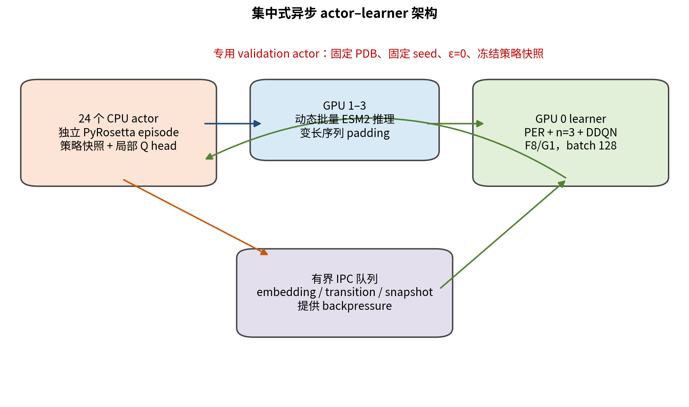{width=16.0cm}

独立验证actor使用固定PDB、固定随机种子、冻结策略快照及 $\epsilon=0$，其转移不写入训练回放。这一隔离是报告能够区分“行为策略回报”和“策略真实性能”的前提。

```{=openxml}
<w:p><w:r><w:br w:type="page"/></w:r></w:p>
```

## 吞吐对比

早期异步A12运行的原始吞吐约为8.55 step/s，串行F8/G1约为3.02 step/s，原始比值约2.83；按核心流水线口径归一后约2.29倍。吞吐提升来自CPU结构操作与GPU编码/学习的重叠执行，而非改变科学任务本身。

actor扩展中，A12、A24、A36的吞吐约为8.16、9.68、9.56 step/s，对应回合时延约23.22、48.72、78.41 s。A24达到最高吞吐；A36未继续提升且显著增加时延，说明共享PyRosetta、队列或GPU编码已成为瓶颈。

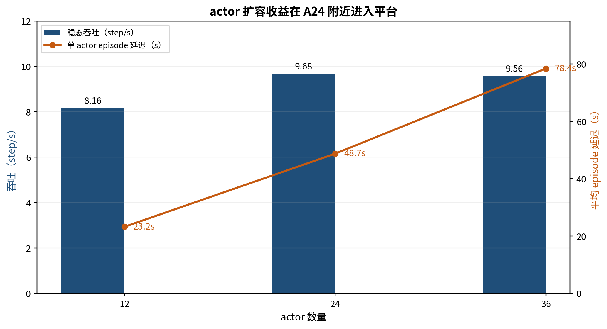{width=15.8cm}

图34支持选择A24而不是简单堆叠actor。未来扩展应优先分析队列等待和各阶段服务时间，只有确认编码或学习器仍有空闲，才值得增加actor。

```{=openxml}
<w:p><w:r><w:br w:type="page"/></w:r></w:p>
```

## 进程生命周期

训练记录曾出现主进程退出后子进程继续占用资源的情况。当前加入 supervisor 和生命周期守卫，统一转发信号、回收worker、记录退出码并检查孤儿进程。该改造不直接提高奖励，却提高了长实验的可审计性，防止“日志停止但计算仍在运行”或不同作业争抢GPU造成的混淆。

检查点同时保存网络、优化器、调度状态和必要的训练进度；大容量回放的恢复需考虑存储与内存开销。固定验证编号、触发episode和global step均写入日志，使策略快照能够与结果对应。

```{=openxml}
<w:p><w:r><w:br w:type="page"/></w:r></w:p>
```

# 训练探索历程

## 探索主线

训练探索并非一次性确定超参数，而是沿“能运行—有终端信号—信用可传播—数值稳定—吞吐可扩展—验证可解释”的顺序推进。主要变化包括：引入终端力学代理；将超长回合缩短到50步再到24步；移除正偏置步奖励；终端奖励放大8倍；引入PER与三步回报；从串行改为异步；加入固定贪婪验证；治理FP16非有限值、慢探索发散、回放内存和进程生命周期。

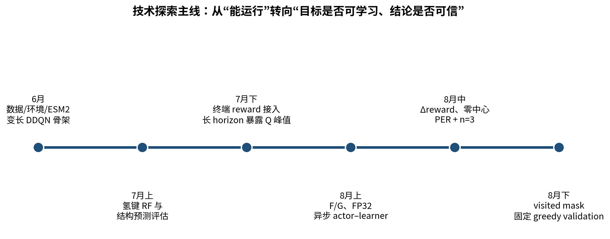{width=16.0cm}

图35表明每次配置变化都针对已观测失败模式。由于多个改动曾在相邻实验中叠加，部分收益无法做严格因果归因；下一阶段应采用单因素或小型析因对照，并固定验证协议。

```{=openxml}
<w:p><w:r><w:br w:type="page"/></w:r></w:p>
```

## 终端奖励接入烟雾测试

早期短程运行的目标是验证终端奖励能否被正确计算、记录并进入回放，而非评估策略性能。烟雾测试覆盖混合长度蛋白、32步回合和基本优化链路。

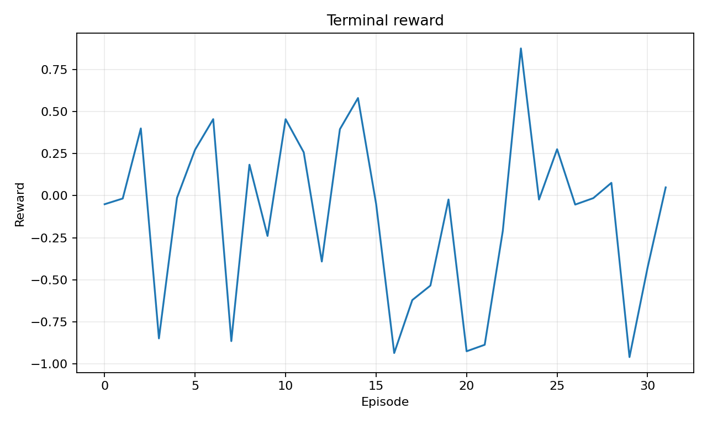{width=15.8cm}

图36确认终端奖励并非常数且能够随轨迹变化。烟雾测试通过只能说明数据路径正确；样本量、探索阶段和非固定蛋白分布使其不适合得出收敛结论。

```{=openxml}
<w:p><w:r><w:br w:type="page"/></w:r></w:p>
```

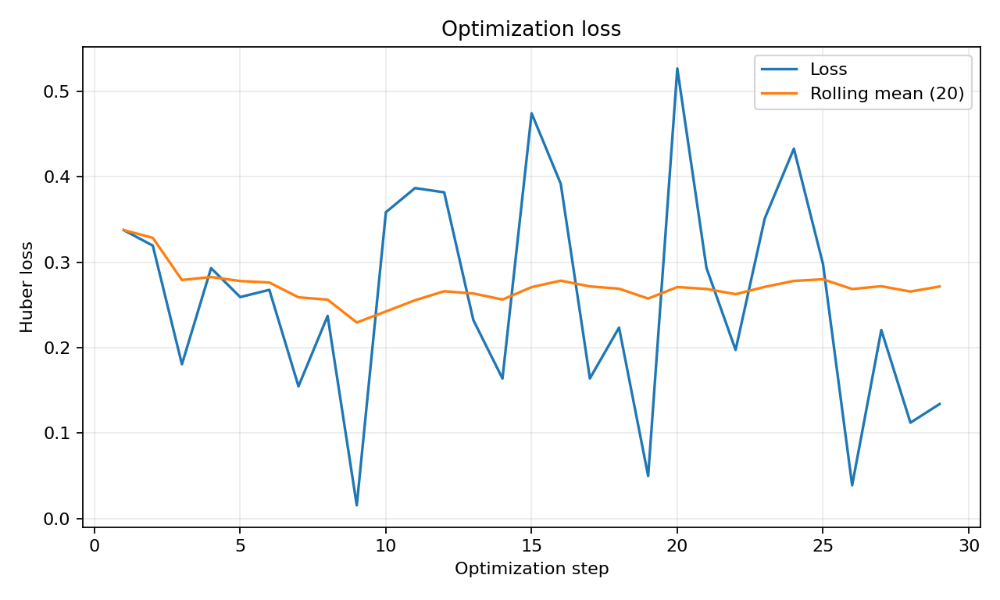{width=15.8cm}

图37用于检查反向传播是否工作。短程损失下降主要说明网络能够拟合当前回放目标，不能说明目标本身正确或策略会获得正终端回报。

```{=openxml}
<w:p><w:r><w:br w:type="page"/></w:r></w:p>
```

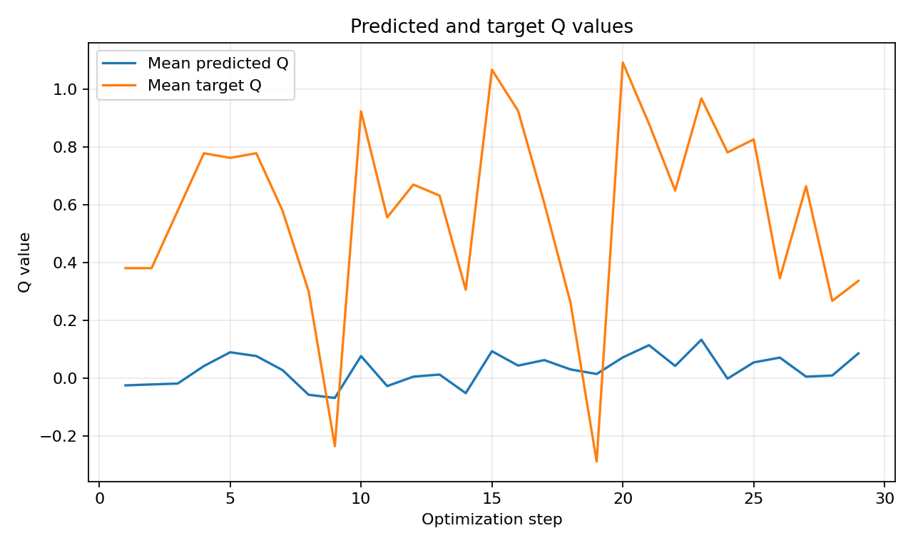{width=15.8cm}

图38建立了Q值监控习惯。后续出现的Q值虚高和极端发散能够被及时识别，说明优化诊断图是必要的工程护栏。

```{=openxml}
<w:p><w:r><w:br w:type="page"/></w:r></w:p>
```

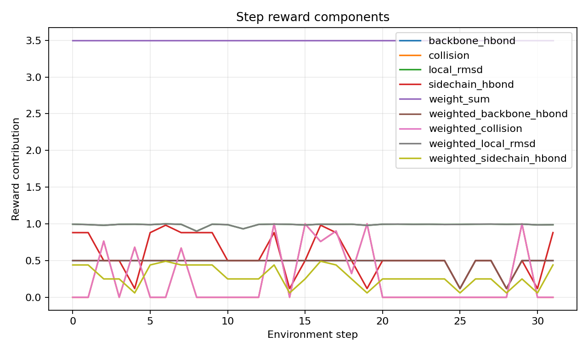{width=15.8cm}

图39验证局部结构分量与终端分量均写入日志。报告要求分量级分析，是因为总奖励改善可能完全由某个容易优化但科学意义较弱的分量驱动。

```{=openxml}
<w:p><w:r><w:br w:type="page"/></w:r></w:p>
```

## 正偏置步奖励与Q值虚高

较早的长回合配置中，步奖励带有持续正基线，回合总回报约15—16，而预测Q值达到79—81，并出现重复/逆向突变倾向。此时智能体可以通过累积局部正奖励获得高回报，终端目标在总回报中的占比很小。结果表现为数值上“Q值很高”，科学目标却没有相应改善。

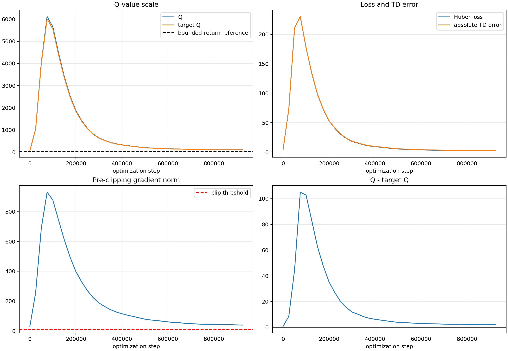{width=15.8cm}

图40记录了损失、TD误差、梯度和Q值的旧阶段行为。它说明Q值绝对量级必须结合奖励总尺度和回合长度判断，不能把Q值上升解释为策略质量提高。

```{=openxml}
<w:p><w:r><w:br w:type="page"/></w:r></w:p>
```

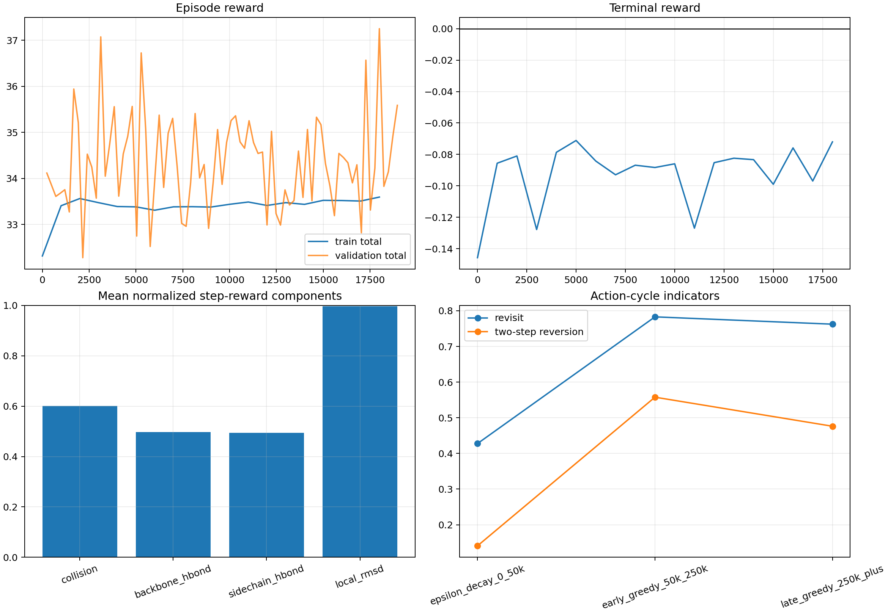{width=15.8cm}

图41支持了缩短回合、禁止重复位点和零中心步奖励三个改动。仅把终端奖励乘以8并未立即解决问题，因为正偏置的逐步累积仍可支配价值函数。

```{=openxml}
<w:p><w:r><w:br w:type="page"/></w:r></w:p>
```

## 异步A12阶段

异步A12阶段验证了CPU结构计算、GPU编码和学习器能够并行运行，并显著提高吞吐。该阶段也暴露了策略滞后、日志对齐和验证隔离的重要性。

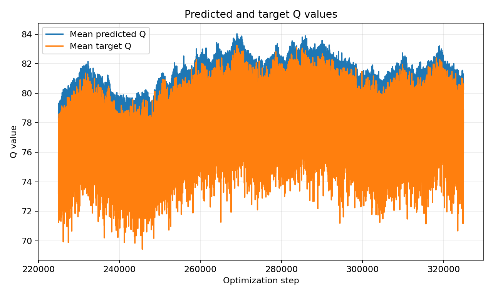{width=15.8cm}

图42显示异步化没有天然解决价值偏置。吞吐提高后，错误奖励或不稳定探索也会被更快放大，因此工程扩展必须与固定验证同步建设。

```{=openxml}
<w:p><w:r><w:br w:type="page"/></w:r></w:p>
```

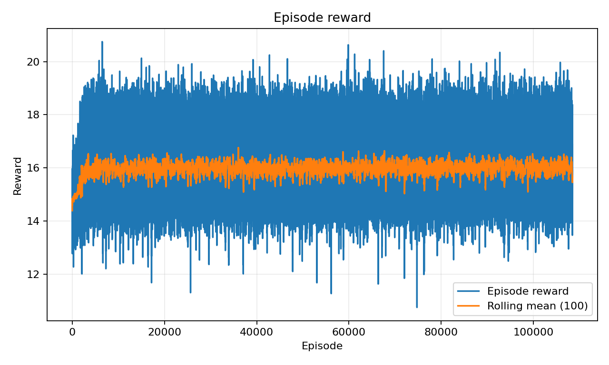{width=15.8cm}

图43中的训练回报波动同时受蛋白难度、$\epsilon$、策略版本和并发actor影响。对异步系统使用简单时间滑动均值时，应避免把样本组成变化误判为策略趋势。

```{=openxml}
<w:p><w:r><w:br w:type="page"/></w:r></w:p>
```

## 半精度与慢探索失败

FP16自动混合精度实验出现非有限值，切换FP32后训练可持续。考虑到Q学习目标同时受极值奖励、掩码和重要性权重影响，半精度恢复前需要分别检查网络前向、目标构造、损失缩放和梯度裁剪，而不能只降低学习率。

另一次将 $\epsilon$ 衰减周期延长至739,296步的实验发生严重瞬态发散，Q最大值一度达到约75,000，且固定目标没有改善，因而终止。恢复约50,000步的默认衰减后数值稳定。该结果不表示“探索越少越好”，而是表明高探索率与异步旧策略、负向稀疏终端分布和离策略回放叠加时，会扩大目标分布漂移。

## 本阶段经验

训练探索得到五条可迁移经验：一是先验证奖励尺度和符号，再扩大模型；二是终端稀疏任务必须同时处理回合长度、抽样可见性和多步信用；三是异步吞吐要以固定验证护航；四是优化稳定只是一项必要条件；五是失败实验也必须保留配置、截止点和退出原因，避免后续重复消耗。

```{=openxml}
<w:p><w:r><w:br w:type="page"/></w:r></w:p>
```

# 最新长训练配置与分析口径

## 运行配置

本节分析运行目录 `async_a24_esm8_f8_g1_prioritized_n3_stepx0.025_terminalx8.0_20260821_093310`。核心配置如下。

| 项目 | 配置 | 设计目的 |
|---|---:|---|
| CPU actor | 24 | 并行PyRosetta环境交互 |
| ESM2 worker | 3（GPU 1—3） | 批量序列表征 |
| learner | 1（GPU 0） | DDQN优化 |
| 状态维度 | 每残基1280+1 | ESM2语义与访问掩码 |
| 最大回合步 | 24 | 提高终端信用和可见性 |
| 局部重排半径 | 8 Å | 控制突变结构影响范围 |
| 步奖励缩放 | 0.025 | 降低局部塑形支配 |
| 终端奖励缩放 | 8.0 | 强化目标差分 |
| 回放容量 | 100,000 | 控制内存并保留多样性 |
| PER | $\alpha=0.6$，$\beta:0.4\rightarrow1$ | 增加高TD误差样本可见性 |
| 多步回报 | $n=3$ | 加快终端信用传播 |
| 折扣因子 | 0.99 | 保留24步长期影响 |
| 批量 | 128 | 稳定更新 |
| 更新节奏 | F8/G1 | 平衡采样和学习 |
| 目标同步 | 每125次优化 | 稳定目标 |
| 参数精度 | FP32 | 避免FP16非有限值 |
| 验证 | 16个固定PDB、$\epsilon=0$ | 独立策略判断 |

## 统计方法

训练日志按 epoch 聚合，完整 epoch 为0—22，第23轮仅有6,877条，明确标为不完整。固定验证每次覆盖16个PDB；报告计算验证均值、25次滑动均值、100次分块均值、单次置信区间和PDB热图。优化器最近10,000个更新用于判断当前数值状态。PER诊断取最近1,000个快照，分别比较全回放、优先级最高1%和实际采样批次。

固定验证中的“正样本比例”是16个蛋白级终端奖励中大于0的比例；“均值显著为正/负”依据单次验证跨16个蛋白的均值置信区间。样本仅16个，置信区间用于内部风险判断，不等同于总体外推统计推断。

```{=openxml}
<w:p><w:r><w:br w:type="page"/></w:r></w:p>
```

# 最新长训练：训练侧结果

## 回合总奖励

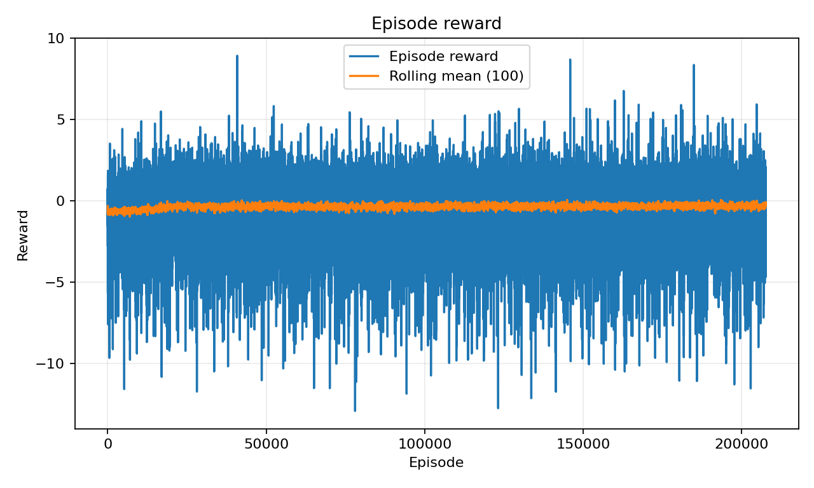{width=15.8cm}

图44呈现训练行为策略下的原始与平滑回报。总体上由更负向区域向较少负向区域移动，但异步采样、蛋白组成和探索率变化均参与这一趋势，故需与固定验证联合解释。

```{=openxml}
<w:p><w:r><w:br w:type="page"/></w:r></w:p>
```

## 终端与步奖励

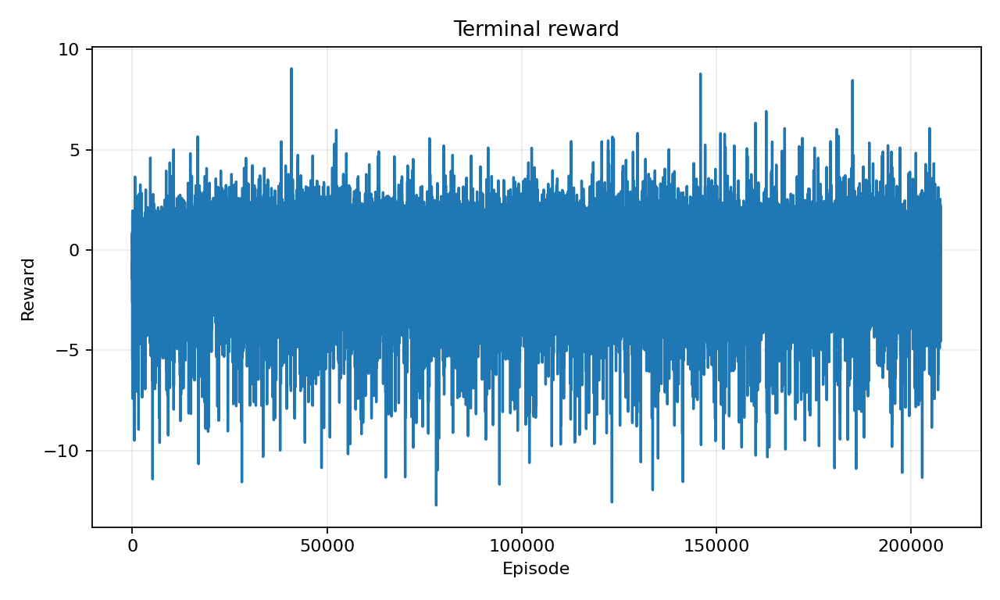{width=15.8cm}

图45显示终端奖励随训练有所“少负化”，但大量负样本长期存在。正样本比例提升不等同于均值转正，因为少数大幅负值可抵消较多小幅正值。

```{=openxml}
<w:p><w:r><w:br w:type="page"/></w:r></w:p>
```

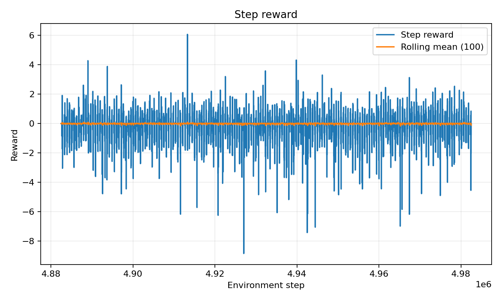{width=15.8cm}

图46验证零中心及缩放后的局部塑形没有像早期配置那样产生巨大的累计正基线。步奖励仍需监测与终端目标的条件相关：若局部奖励偏好的动作与终端代理长期负相关，应进一步减权或改为硬约束。

```{=openxml}
<w:p><w:r><w:br w:type="page"/></w:r></w:p>
```

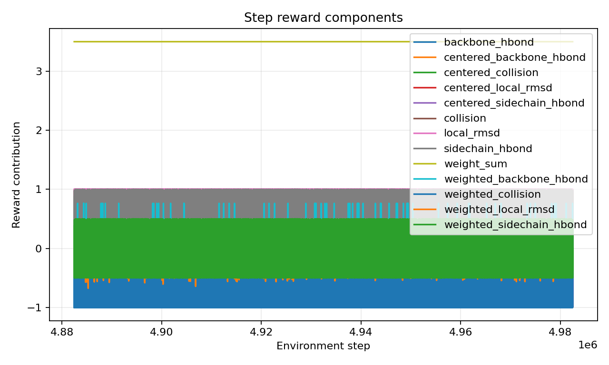{width=15.8cm}

图47用于辨认总奖励趋势来源。训练轮聚合显示改善主要来自 toughness 分量，strength 分量长期接近零且略负，说明双目标并未同步学习。

```{=openxml}
<w:p><w:r><w:br w:type="page"/></w:r></w:p>
```

## 探索率

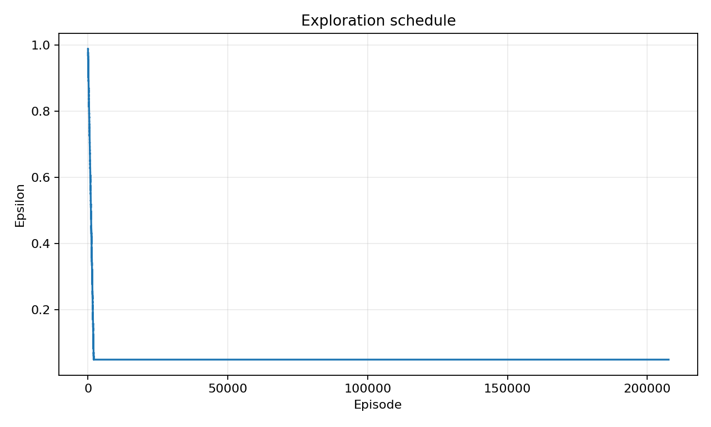{width=15.8cm}

图48显示探索率在早期衰减至0.05。第0轮平均 $\epsilon=0.176$，其后完整轮均接近0.05。训练均值在前几轮快速改善，一部分可能来自随机动作减少；这正是必须使用 $\epsilon=0$ 固定验证的原因。

```{=openxml}
<w:p><w:r><w:br w:type="page"/></w:r></w:p>
```

## 按训练轮聚合

前184,000条训练记录中，第0轮平均总奖励 -0.651、终端奖励 -0.546、strength -0.00727、toughness -0.129；第22轮相应为 -0.330、-0.239、-0.00545、-0.0542。第23轮不完整样本为6,877条，其终端均值 -0.229。第23轮终端、strength、toughness 正样本比例约为42.3%、50.5%和40.7%。

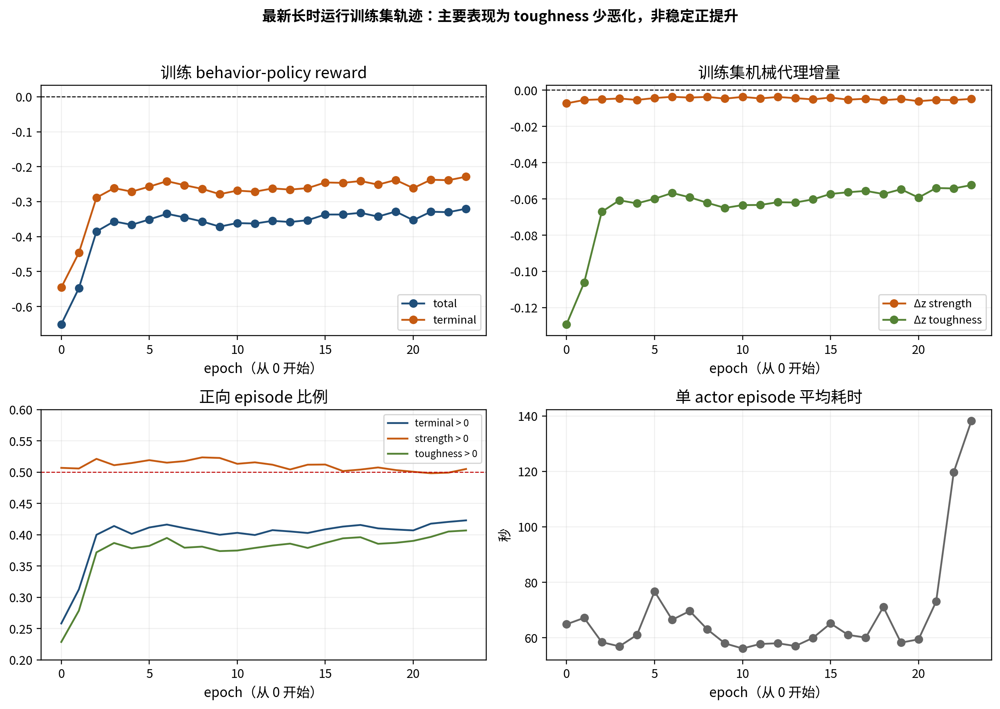{width=16.0cm}

图49支持“行为策略下负向幅度降低”的表述，但不支持“策略已实现正向优化”。strength 均值没有实质性改善，toughness 是主要变化来源；不完整第23轮也不能与完整轮作严格等权比较。

```{=openxml}
<w:p><w:r><w:br w:type="page"/></w:r></w:p>
```

# 最新长训练：优化稳定性

## 损失与TD误差

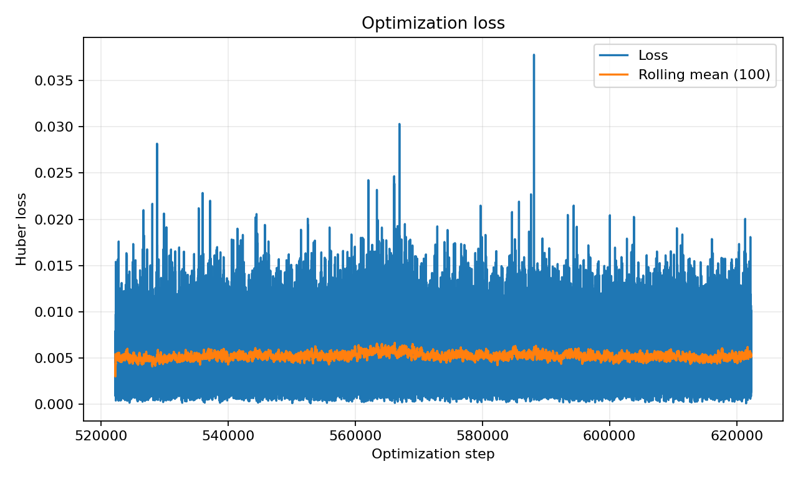{width=15.8cm}

图50显示早期瞬态后损失保持有限。最近10,000次更新中，loss 均值约0.00521，99分位约0.0128，最大约0.0206，未见先前慢探索实验中的爆炸。

```{=openxml}
<w:p><w:r><w:br w:type="page"/></w:r></w:p>
```

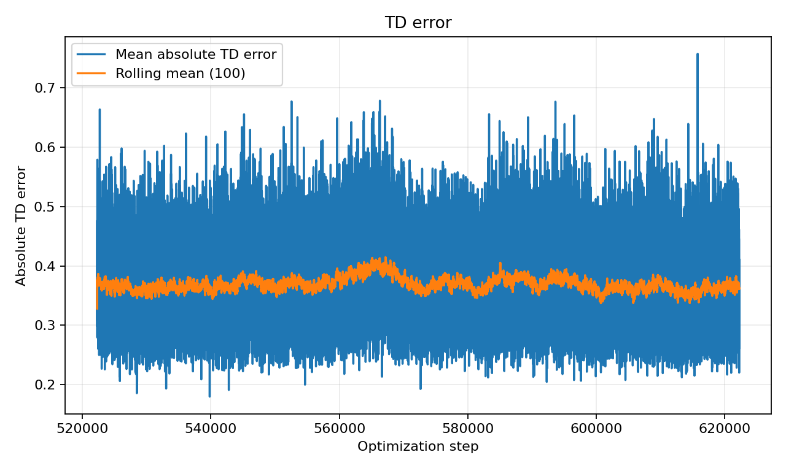{width=15.8cm}

最近10,000次更新的绝对TD误差均值约0.371、最大约0.677。TD误差受PER抽样影响，不能与均匀回放实验直接横比；其稳定量级表明当前目标分布没有数值爆炸。

```{=openxml}
<w:p><w:r><w:br w:type="page"/></w:r></w:p>
```

## 梯度与Q值

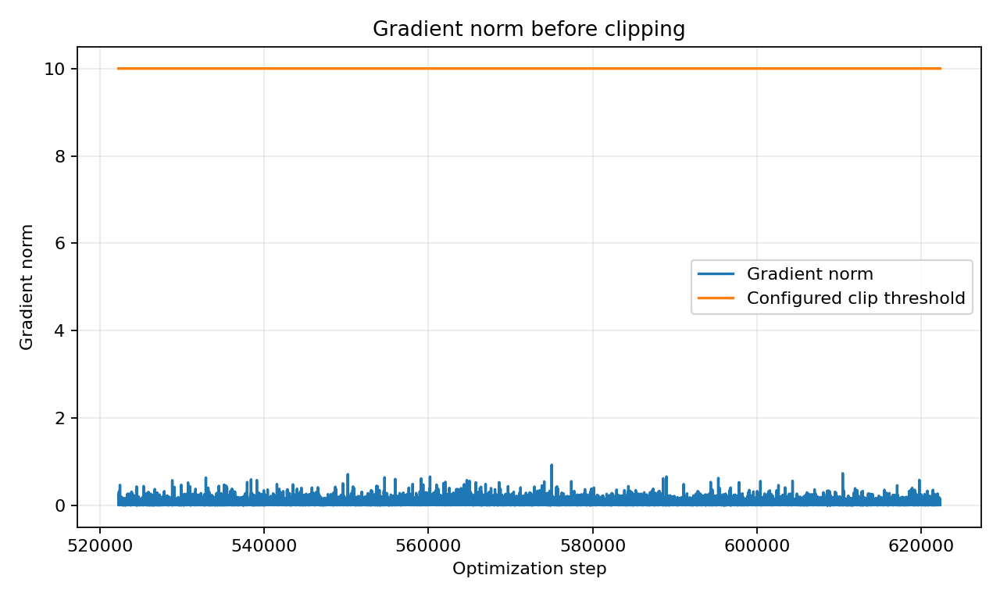{width=15.8cm}

图52中最近10,000次更新梯度范数均值约0.0448、最大约0.712，远低于裁剪阈值10。这说明当前训练未依靠频繁硬裁剪维持表面稳定，也提示学习信号整体较弱。

```{=openxml}
<w:p><w:r><w:br w:type="page"/></w:r></w:p>
```

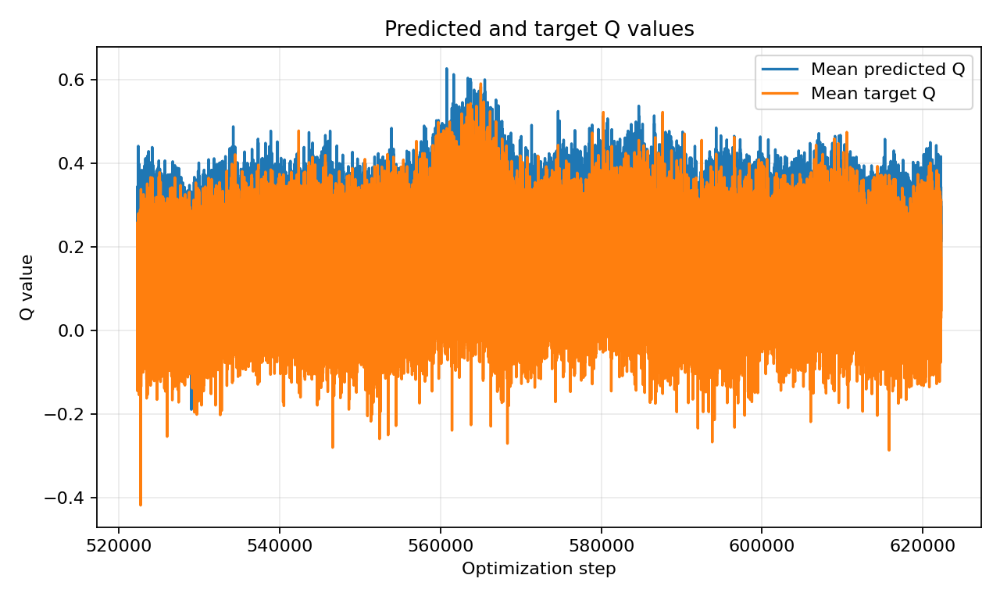{width=15.8cm}

图53中最近10,000次更新Q均值约0.253、最大约0.478；目标Q均值约0.128、最大约0.422。该量级与当前缩放奖励相容，不再出现79—81或数万的异常值。

```{=openxml}
<w:p><w:r><w:br w:type="page"/></w:r></w:p>
```

## 分箱趋势

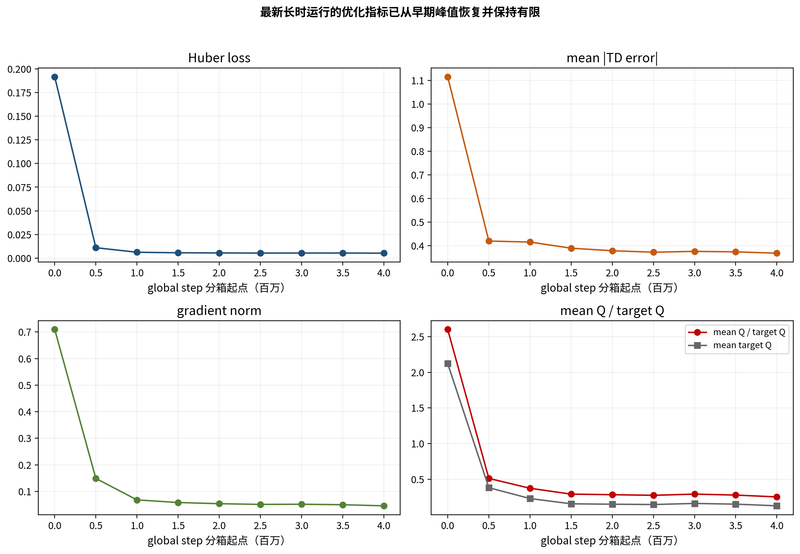{width=16.0cm}

图54把长序列更新按时间分箱，减少高频噪声。综合损失、TD误差、梯度与Q值可判定“数值稳定”；但数值稳定与固定验证为负同时成立，意味着下一步应转向奖励和数据诊断。

```{=openxml}
<w:p><w:r><w:br w:type="page"/></w:r></w:p>
```

# 最新长训练：固定验证结果

## 总体轨迹

770次固定验证均覆盖相同16个PDB。未训练基线的平均终端奖励约 -1.109；前50次验证均值 -0.683，后50次 -0.497，后200次 -0.450。全程最佳25次滑动均值仍为 -0.268，最后25次滑动均值回落至 -0.532。

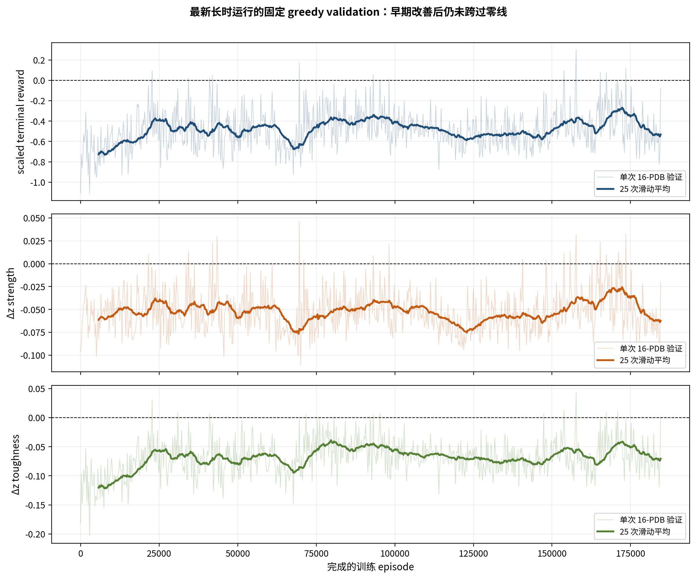{width=16.0cm}

图55显示 toughness 的负向幅度相较基线有所减小，而 strength 轨迹没有稳定上升。验证编号与 strength 的线性相关仅0.027，toughness 为0.232；这支持“韧性代理有早期少负化、强度代理无明显趋势”的分解结论。

```{=openxml}
<w:p><w:r><w:br w:type="page"/></w:r></w:p>
```

## 分块稳定性

将验证按100次分块，终端均值依次约为 -0.584、-0.480、-0.521、-0.393、-0.477、-0.542、-0.427 和 -0.442（末块70次）；对应蛋白级正样本比例约为24.9%、30.4%、30.4%、38.2%、37.9%、32.4%、35.2%和33.3%。

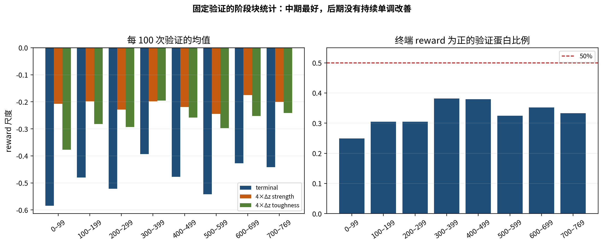{width=16.0cm}

图56中第300—399次验证相对较好，但随后没有持续改善，说明局部最好窗口不能视为收敛。若用最佳检查点，应在独立选择集上确定，再在从未参与选择的测试集上一次性报告，避免“从770次中挑最好”的多重比较偏差。

```{=openxml}
<w:p><w:r><w:br w:type="page"/></w:r></w:p>
```

## 置信区间判定

770次验证中，仅14次的16蛋白平均终端奖励大于0；有257次均值置信区间完全低于0，置信区间完全高于0的次数为0。该统计比“个别蛋白有正奖励”更严格，直接否定了“已经获得稳定正向平均策略”的结论。

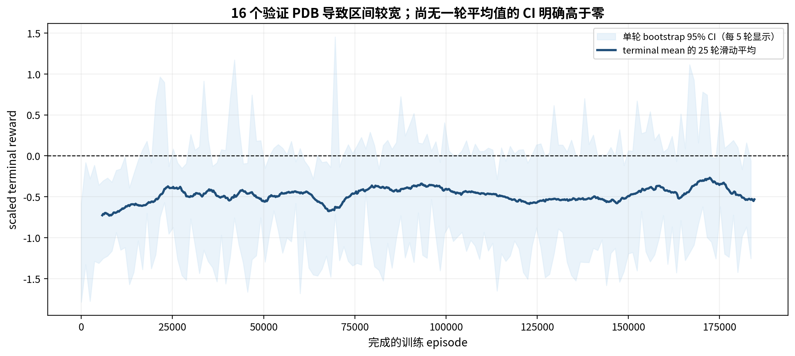{width=16.0cm}

图57是本报告最重要的结果图之一。尽管训练数值稳定且回报少负化，策略尚未跨过零基线。下一阶段的主要成功指标应预先定义为：多个连续窗口平均转正、置信区间不再系统负向、并在多种子上复现。

```{=openxml}
<w:p><w:r><w:br w:type="page"/></w:r></w:p>
```

## 蛋白间异质性

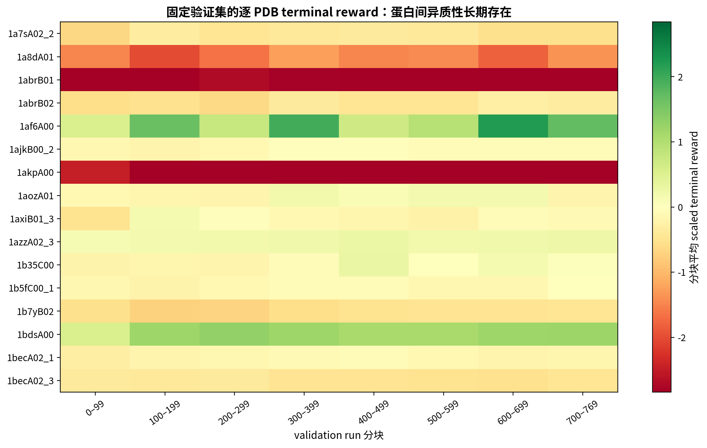{width=16.0cm}

图58显示不同蛋白对策略响应显著不同。总体负值可能来自一组持续困难蛋白，也可能是每个蛋白均有轻度退化。后续应按蛋白报告可达上界、正向动作密度和结构类别，以判断是否需要条件化策略或分任务课程学习。

```{=openxml}
<w:p><w:r><w:br w:type="page"/></w:r></w:p>
```

# 优先经验回放诊断

## 回放分布与抽样偏置

最近1,000个诊断快照中，全回放终端转移比例约12.50%，终端正样本率42.54%，终端均值 -0.227。优先级最高1%的转移中，终端比例升至78.44%，但终端正样本率降至11.36%，终端均值降至 -1.754；实际批次中终端比例约29.27%，终端正样本率31.84%，终端均值 -0.526。importance weight 均值约0.130，说明高概率样本受到明显修正，但有限批次和函数逼近下仍存在有效偏置。

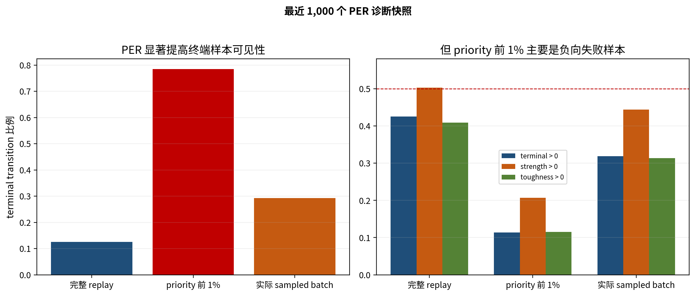{width=16.0cm}

图59解释了为何终端信息“看得更多”仍未得到正向策略：高TD误差集中于大幅负向失败，PER把学习资源优先用于失败规避。失败规避可以把 -1.1 提升到 -0.4，却不保证发现大于0的轨迹。

## 分量诊断

全回放中 strength 正样本率约50.26%、均值 -0.00435，toughness 正样本率约40.87%、均值 -0.05229。优先级最高1%中，strength 正样本率约20.68%、均值 -0.1149；toughness 正样本率约11.54%、均值 -0.3235。由此可见，极端优先样本主要是 toughness 大幅下降，同时包含一定 strength 下降。

这并不要求取消PER。更合理的对照包括：按终端正负分层采样；对终端正样本设置最低批次配额；优先级采用截断或rank-based形式；将正向发现缓冲区与一般TD误差缓冲区混合；同时保留重要性修正。任何改动都应比较固定验证和正向覆盖，而不是只看loss。

```{=openxml}
<w:p><w:r><w:br w:type="page"/></w:r></w:p>
```

# 结果综合分析与问题定位

## 已经取得的成果

一是实现了从序列动作到结构更新、氢键特征、双目标代理、终端差分和DDQN学习的端到端闭环。二是通过动作掩码、禁止重复位点、短回合、零中心步奖励和三步回报，使任务定义比早期版本更一致。三是建立了24 actor异步流水线、独立验证和进程治理，能够持续生成可审计数据。四是解决了FP16非有限值和旧奖励导致的Q值异常，最新长训练在超过440万环境步时仍保持数值稳定。五是通过CATH、MechanoPro和蜘蛛丝评估明确了代理适用边界。

这些成果具有科研价值，因为它们把“结果不好”的模糊状态拆解为可测试假设。当前主要障碍已经不是程序是否能跑，而是代理是否提供正确方向、正向轨迹是否可达、以及训练是否获得足够的正向反事实。

## 尚未取得的结果

现有证据不支持以下声明：策略能够稳定增强实验力学性能；策略能够稳定提升当前代理的固定验证均值；strength与toughness两个目标均被学会；高代理分数候选在MechanoPro或蜘蛛丝数据上具有可靠富集；继续当前配置足够久必然转正。

尤其需要避免把“基线 -1.109 改善到后200次 -0.450”表述为成功。它说明策略比未训练状态少犯部分严重错误，但零点代表初末无退化，平均仍低于零即意味着总体上仍使代理变差。

## 主要原因假设

### 代理目标与真实目标错位

外部数据没有显示正向直接映射，且序列长度在模型中占主导。智能体可能在优化氢键特征组合，而这些组合并不对应目标加载路径；即使终端代理转正，也可能缺乏实验意义。

### 正向动作密度低

PER顶部样本高度负向、固定验证正向均值极少，可能说明24步组合空间中正向轨迹稀疏。若随机或局部贪婪扫描也很少发现正动作，则DDQN的失败首先是可达性问题。

### 状态与奖励的可识别性不足

ESM2嵌入描述序列语义，但Q网络若没有显式看到氢键图、局部几何、当前代理分量和突变前后差，可能难以预测某位置某氨基酸对结构奖励的影响。访问掩码解决了历史合法性，却不能补足结构因果信息。

### 局部结构更新噪声

突变加8 Å局部重排能控制计算量，但不同侧链构象和氢键判断阈值可能使小奖励差不可重复。若同一动作重复重排的方差接近平均增益，价值网络学习的是随机建模噪声。

### 多目标冲突与不等置信度

strength代理的 $R^2$ 明显低于 toughness，固定验证也主要由 toughness 少负化。等权平均把不同可靠度、不同可达性的目标混在一个标量中，可能产生一升一降且总值噪声较大的动作排序。

### 离策略分布偏置

异步actor的策略滞后、低但非零的探索率、PER对极端失败的偏好和$n$步回报共同改变训练分布。学习器当前更像失败规避器，缺少稳定的正向示范或目标条件化探索。

## 原因优先级

| 优先级 | 假设 | 最低成本检验 | 通过标准 | 失败后的动作 |
|---:|---|---|---|---|
| P0 | 代理方向不可靠 | 对已有高保真/外部数据重校准并做适用域分析 | 同任务、同加载定义下方向稳定 | 重建标签或奖励 |
| P0 | 正向动作不可达/稀疏 | 16个固定PDB单点全扫描及短束搜索 | 每个蛋白存在足够正动作和组合上界 | 改动作/结构更新/目标 |
| P1 | 结构奖励噪声过大 | 同一动作多次重排与方差分解 | 信噪比满足排序需求 | ensemble/更高保真松弛 |
| P1 | 状态缺少结构信息 | 加入氢键图/当前特征的短程对照 | 固定验证显著优于纯ESM2 | 改Q网络表示 |
| P1 | PER过度偏向负样本 | 分层回放小规模多种子对照 | 正样本覆盖与验证同时提升 | 保留/回退采样策略 |
| P2 | 目标权重不合理 | 单目标与Pareto对照 | 至少单头稳定转正 | 重新定义多目标组合 |
| P3 | 训练规模不足 | 仅在P0/P1通过后延长 | 验证随预算稳定改善 | 停止规模化 |

```{=openxml}
<w:p><w:r><w:br w:type="page"/></w:r></w:p>
```

# 阶段结论

## 对技术目标的结论

当前系统优化的是“由SMD标签训练、以氢键网络与长度特征表示的结构代理变化”。从机制上可将其称为氢键介导的粘附/内聚潜力，但更接近单链内部内聚与结构稳定代理，不等同于界面粘附，也不等同于宏观材料力学性能。报告题名保留“粘附/内聚潜力”，是为了突出当前reward的实质，同时用“潜力”和“代理”限定证据边界。

## 对模型实现的结论

系统实现已经具备继续开展受控科研实验的工程条件。动作合法性、初末结构一致性、终端信用、异步采样、验证隔离和进程回收等关键问题均有明确实现。139项自动化测试通过、2项跳过，为数据集、环境、agent、回放、异步和验证模块提供回归保护。

## 对训练探索的结论

从1,024步缩短到24步、移除正偏置、使用FP32、引入PER/$n$步和异步A24，是本阶段最有依据的改进。它们分别解决终端不可见、价值虚高、非有限值、稀疏传播和吞吐问题。慢探索和盲目扩大回放没有带来目标改善，说明“更多数据/更久训练”并非当前主矛盾的充分解。

## 对当前结果的结论

最新运行已经呈现训练行为回报少负化和优化数值稳定，但固定验证仍为负：最佳25次滑动均值 -0.268，最后25次 -0.532，770次中无一次均值置信区间显著为正。strength分量无清晰趋势，toughness仅有有限的少负化。故阶段判定为：**工程验证通过，学习迹象存在，策略有效性未通过，实验候选交付不建议。**

## 指导意义

当前负结果不是“模型完全失败”，而是帮助项目确定了下一阶段的正确顺序：先证明正奖励在动作空间中可达，再使状态表达足以预测该奖励，之后比较采样策略，最后才扩大训练并做高保真外推。该顺序能显著降低继续长训却无法解释结果的风险。

```{=openxml}
<w:p><w:r><w:br w:type="page"/></w:r></w:p>
```

# 下一阶段研究方案

## 第一阶段：代理校准与适用域

1. 明确 `v127/v128` 的单位、加载方向、端点定义和数据生成条件，形成数据字典。
2. 用结构/序列族隔离的嵌套交叉验证重估性能，并报告置信区间。
3. 训练去长度化目标或在同长度内构造残差标签，比较“长度+氢键”“仅氢键”“长度残差”三类模型。
4. 使用随机森林树间方差、bootstrap ensemble或共形区间估计预测不确定性。
5. 把适用域距离和结构质量写入候选筛选；对高不确定预测不发放高置信正奖励。

阶段门槛：在与实际优化任务相符的数据上，目标差分的重复性和方向准确率达到预设阈值；否则不进入长强化学习。

## 第二阶段：可达性地图

对16个固定PDB执行每个可变位点×19种非同源氨基酸的单点扫描，重复若干侧链重排，记录两个代理差分、结构约束、均值和方差。随后用束搜索或贪婪搜索构造2—4步组合，估计正向轨迹比例和理论上界。

建议输出：每个PDB的正向单点比例、最佳单点/组合增益、两目标Pareto前沿、位点热图、重复重排信噪比及动作间非加性。若大量PDB没有可靠正动作，应修改奖励或动作执行，不应训练价值网络。

## 第三阶段：可学性最小实验

在确认可达的2—4个PDB上建立小任务：回合4—8步；固定训练/验证蛋白；对比随机、贪婪单步、监督动作排序、均匀回放DDQN和分层回放DDQN。状态对照至少包括纯ESM2、ESM2+当前7维特征、ESM2+局部氢键图。每项使用不少于3个随机种子，并以固定验证均值和正向比例为唯一主指标。

阶段门槛：DDQN稳定优于随机和简单贪婪基线，并跨种子复现。若监督动作排序也不能学习，则优先改状态/标签；若监督可学而DDQN不可学，再改信用与回放。

## 第四阶段：采样与多目标设计

在最小任务通过后，比较均匀PER、当前TD-PER、正负分层PER和“正向发现缓冲区+普通回放”的混合方案。多目标方面，先独立训练 toughness，再独立训练 strength，最后比较加权和、约束优化及Pareto Q学习。权重应依据代理置信度和项目需求预先确定，不以训练后曲线最好为选择标准。

## 第五阶段：高保真候选复核

仅对通过固定验证、多种子复现和适用域检查的候选执行更完整的结构松弛、重复结构预测、能量与聚集风险过滤，再选少量做SMD或实验。应保留未优化野生型、随机突变、代理贪婪和RL四组对照，并盲化高保真评价。

## 建议里程碑

| 里程碑 | 交付物 | 成功判据 | 建议计算策略 |
|---|---|---|---|
| M1 目标审计 | 数据字典、去长度化模型、不确定性 | 差分方向可重复 | 以离线评估为主 |
| M2 可达性 | 单点/短组合地图 | 固定PDB存在可靠正轨迹 | 并行扫描，不训练RL |
| M3 最小可学 | 多基线、多种子短实验 | 固定验证优于基线 | 小规模快速迭代 |
| M4 全集复现 | 16 PDB固定验证 | 连续窗口均值转正 | 恢复A24异步 |
| M5 高保真验证 | SMD/实验对照 | 方向保留并有富集 | 限量高成本计算 |

```{=openxml}
<w:p><w:r><w:br w:type="page"/></w:r></w:p>
```

# 风险管理与质量保证

## 科学风险

最高风险是代理利用：RL找到随机森林的外推漏洞，而非更优蛋白。控制措施包括适用域、ensemble不确定性、保守奖励、周期性高保真复核和盲化测试。第二风险是跨尺度误释，应在所有图表和候选说明中明确“代理层/机制层/实验层”。第三风险是选择偏差，必须预先定义主指标、检查点选择集和最终测试集。

## 计算风险

PyRosetta并发和大回放会带来内存压力；GPU worker、actor和learner之间可能出现背压；主进程异常可能遗留子进程。应继续保留有界队列、资源水位记录、supervisor、优雅信号处理和独立检查点完整性验证。容量变更必须先做峰值内存测量，不从单次 `SIGKILL` 直接推断根因。

## 软件质量

本报告生成前运行项目测试，结果为 **139 passed，2 skipped**。测试覆盖数据加载、环境、DDQN、经验回放、n-step、异步训练、奖励与固定验证等核心模块。测试通过证明实现满足现有契约，但不证明科学假设正确；每个新奖励版本还需增加数值基准测试和已知结构的黄金样例。

## 可复现性

每次正式实验至少保存：代码提交标识与工作区差异、完整命令、环境包版本、随机种子、数据索引、代理模型哈希、PDB来源、所有奖励参数、日志截止点、检查点和验证快照。报告图表应从原始CSV/JSON自动生成，不手工修改曲线。本报告的分析快照保存在 `report/analysis_snapshot.json`，图表生成逻辑保存在 `report/generate_assets.py`。

```{=openxml}
<w:p><w:r><w:br w:type="page"/></w:r></w:p>
```

# 附录A：核心数学定义

## 动作价值目标

对于非终止转移，Double DQN的一步目标为

$$
y_t=r_t+\gamma Q_{\theta^-}\left(s_{t+1},\arg\max_{a\in\mathcal{A}_{valid}(s_{t+1})}Q_\theta(s_{t+1},a)\right),
$$

其中在线网络参数为 $\theta$，目标网络为 $\theta^-$，合法动作集合由当前序列、访问掩码和结构约束决定。终止转移目标为 $y_t=r_t$。三步回报时，前项替换为三步折扣奖励和，并在未终止时从 $t+3$ 状态bootstrap。

## Huber损失

令TD误差 $\delta=y-Q_\theta(s,a)$，Huber损失在小误差区使用二次项，在大误差区使用线性项，从而降低极端终端奖励对梯度的支配。PER根据误差更新优先级，importance weight用于修正非均匀抽样。

## 终端差分

两个输出先按代理训练统计量转为z分数，再计算同源初末结构差分。等权终端奖励的优点是解释简单，缺点是默认两目标可靠度相同。未来可使用

$$
R=w_s\Delta z_s+w_t\Delta z_t-\lambda_u U-\lambda_c C,
$$

其中 $U$ 为代理不确定性，$C$ 为结构约束违例，$w_s,w_t$ 经独立校准而定。若结构约束必须满足，优先把 $C$ 作为动作/候选硬门槛，而不是允许高代理分数无限抵消结构破坏。

```{=openxml}
<w:p><w:r><w:br w:type="page"/></w:r></w:p>
```

# 附录B：关键结果汇总

## 代理模型

| 场景 | toughness | strength | 说明 |
|---|---:|---:|---|
| 随机划分测试 $R^2$ | 0.6566 | 0.3021 | 705个测试样本 |
| 随机划分测试 Spearman | 0.8897 | 0.8324 | 排序优于绝对回归 |
| 相似性划分测试 $R^2$ | 0.6311 | 0.2211 | 分布隔离后下降 |
| 相似性划分 Spearman | 0.8844 | 0.8124 | 排序仍有保留 |
| CATH参考结构 Spearman | 0.8891 | 0.8326 | 705样本 |
| CATH预测结构 $R^2$ | 0.0188 | 0.0514 | 绝对值显著漂移 |
| CATH预测结构 Spearman | 0.7427 | 0.8168 | 排序部分保留 |
| MechanoPro实验力 Spearman | -0.374 | -0.392 | 约38个聚合PDB |
| 蜘蛛丝材料同名指标 Spearman | -0.138 | -0.073 | 类型平衡口径 |

## 最新训练与验证

| 指标 | 数值 | 解读 |
|---|---:|---|
| 训练记录 | 184,000 | 23个完整轮+1个不完整轮 |
| 全局环境步截断 | 4,432,416 | 优化分析截止 |
| 固定验证次数 | 770 | 每次16个PDB |
| 训练第0轮终端均值 | -0.5456 | 早期行为策略 |
| 训练第22轮终端均值 | -0.2386 | 少负化但未转正 |
| 验证前50次终端均值 | -0.6828 | 固定贪婪策略 |
| 验证后50次终端均值 | -0.4967 | 仍为负 |
| 最佳25次滑动均值 | -0.2680 | 仍未跨零 |
| 最后25次滑动均值 | -0.5321 | 后期回退 |
| 平均终端奖励大于0次数 | 14/770 | 偶发，不稳定 |
| 均值CI显著大于0次数 | 0/770 | 未通过 |
| 均值CI显著小于0次数 | 257/770 | 负向证据充分 |

## 最近优化状态

| 指标 | 均值 | 最大值/高分位 | 判定 |
|---|---:|---:|---|
| Huber loss | 0.00521 | max 0.02057；P99 0.01277 | 稳定 |
| 绝对TD误差 | 0.37068 | max 0.6774 | 稳定 |
| 梯度范数 | 0.04482 | max 0.712 | 无爆炸 |
| Q值 | 0.25319 | max 0.4776 | 与奖励尺度相容 |
| 目标Q值 | 0.12774 | max 0.4221 | 有限 |
| importance weight | 0.12963 | — | PER修正明显 |

```{=openxml}
<w:p><w:r><w:br w:type="page"/></w:r></w:p>
```

# 附录C：固定验证对象

固定验证包含16个结构对象：`1a7sA02_2`、`1a8dA01`、`1abrB01`、`1abrB02`、`1af6A00`、`1ajkB00_2`、`1akpA00`、`1aozA01`、`1axiB01_3`、`1azzA02_3`、`1b35C00`、`1b5fC00_1`、`1b7yB02`、`1bdsA00`、`1becA02_1` 和 `1becA02_3`。

选择固定集合的目的，是在训练期间保持输入难度不变。它不是完整的蛋白总体代表集，后续应增加按长度、折叠类别、初始代理分位数和正向可达性分层的外部测试集。固定验证中的任何检查点选择都应与最终测试隔离。

建议为每个对象建立“验证卡”：初始长度、二级结构组成、氢键特征、代理基线、单点正动作比例、最佳可达增益、重复重排方差、各检查点表现和失败动作类型。PDB热图只有与这些结构属性联动后，才能转化为机制认识。

```{=openxml}
<w:p><w:r><w:br w:type="page"/></w:r></w:p>
```

# 附录D：代码模块与职责

| 模块 | 主要文件 | 职责 |
|---|---|---|
| 总训练入口 | `training.py` | 配置、训练循环、恢复与检查点 |
| 异步入口 | `asynchronous_training.py` | 进程拓扑、队列与异步调度 |
| 异步运行时 | `model/asynchronous_module/runtime.py` | actor/worker/learner执行逻辑 |
| 环境 | `model/environment_module/environment.py` | 状态、动作、PyRosetta结构更新 |
| 编码 | `model/encoding_module/esm2_encoder.py` | ESM2每残基表示 |
| 智能体 | `model/agent_module/ddqn_agent.py` | DDQN、动作掩码、优化与目标网络 |
| 回放 | `model/replay_buffer_module/replay_buffer.py` | 均匀/PER经验存储与抽样 |
| 多步回报 | `model/replay_buffer_module/n_step.py` | n-step转移聚合 |
| 局部奖励 | `model/reward_module/reward_calculators.py` | 碰撞、氢键、RMSD等分量 |
| 终端奖励 | `model/reward_module/terminal_reward/calculator.py` | 初末代理差分与缩放 |
| 特征 | `model/reward_module/terminal_reward/features.py` | 七维氢键/拓扑特征 |
| 模型工件 | `model/reward_module/terminal_reward/model_artifact.py` | RF加载、特征契约与预测 |
| 固定验证 | `model/evaluation_module/greedy_validation.py` | 冻结贪婪策略评估 |
| 日志 | `model/logging_module/training_logger.py` | 训练、优化和诊断记录 |
| 监督代理 | `model/reward_module/mechanical-properties-predictor/` | 数据、模型、指标和分析笔记本 |
| 进程监管 | `scripts/supervise_training.sh` | 信号、退出码与子进程回收 |

模块化设计允许分别替换代理、环境和学习器。下一阶段建议保持接口稳定，新增奖励版本时保存版本标识和特征契约，禁止静默覆盖已有模型工件。

```{=openxml}
<w:p><w:r><w:br w:type="page"/></w:r></w:p>
```

# 附录E：实验报告最小模板

每次实验建议按以下结构归档，以便横向比较：

1. 研究假设：本实验只改变什么，预期影响哪个失败模式。
2. 基线与对照：相同数据、种子、验证集和预算下的对照配置。
3. 配置快照：状态、动作、奖励、回合、网络、优化、回放、actor、硬件。
4. 数据口径：日志起止、缺失行、异常退出、恢复次数及排除规则。
5. 主结果：固定验证均值、置信区间、正样本率、跨蛋白分布和多种子结果。
6. 辅助结果：训练回报、PER构成、TD误差、Q值、梯度、吞吐和资源水位。
7. 结论：假设支持/不支持/证据不足，禁止只用“曲线看起来更好”。
8. 下一动作：继续、回退、修改目标或停止，并说明门槛。

建议在实验启动前写出成功判据。例如：“最后5个固定验证窗口的终端均值均大于0，且至少2个随机种子95%区间不低于0”；不得在看到曲线后临时更换窗口或指标。

```{=openxml}
<w:p><w:r><w:br w:type="page"/></w:r></w:p>
```

# 附录F：术语表

| 术语 | 本报告中的含义 |
|---|---|
| 力学代理 | 随机森林对SMD toughness/strength标签的预测 |
| 粘附/内聚潜力 | 对氢键网络代理的机制层工作性解释，不是直接实验量 |
| 终端奖励 | 回合终态与初态的两个标准化代理差，经权重与缩放组合 |
| 步奖励 | 每次突变后的局部碰撞、氢键和RMSD塑形信号 |
| 固定验证 | 固定PDB、固定种子、冻结策略、$\epsilon=0$且不入回放的评估 |
| 行为策略 | 产生训练经验的异步 $\epsilon$-greedy 策略 |
| DDQN | 用在线网络选动作、目标网络评价动作的双重深度Q学习 |
| PER | 按TD误差优先抽样并使用importance weight修正的经验回放 |
| n-step | 聚合多步奖励后再bootstrap的信用传播方法 |
| 少负化 | 指标由更大负值接近零，但尚未达到正向提升 |
| 代理利用 | 优化器利用预测模型误差获得高分，而非改善真实目标 |
| 适用域 | 代理训练分布覆盖、可合理信任预测的输入区域 |

```{=openxml}
<w:p><w:r><w:br w:type="page"/></w:r></w:p>
```

# 附录G：证据来源与审计说明

本报告的事实来源分为四类：其一，当前仓库中的可执行代码，用于确认实现与默认逻辑；其二，`weekly/` 中2026年7—8月周报，用于还原阶段目标与实验决策；其三，`record/` 中环境、奖励、DDQN、预测器、日志和长训练修改记录，用于追踪失败模式与配置演进；其四，训练输出目录中的CSV、JSON和PNG，用于冻结定量结论。

图5—29及图36—53中的原始实验图由对应训练或评估流程生成后复制到报告资产目录；图1—4、图30—35及图54—59由报告脚本根据代码、记录和冻结日志二次绘制。二次绘图不改变原始数值，只统一中文标签、统计窗口和版式。`analysis_snapshot.json` 保存主要数值和原始图片路径，便于审计。

由于最新长训练在报告编制时仍运行，本报告不是该实验的最终结果。后续若更新，应重新冻结日志、生成新快照、标注版本日期，并保留本版文件，不应在原文档中静默替换数值。

## 最终判定

本项目已经形成可靠的强化学习研究平台，并通过系统探索消除了多项工程和数值障碍；但“策略稳定提高氢键介导粘附/内聚潜力”尚未获得固定验证支持，“提高实验力学性能”更缺乏跨尺度证据。下一阶段最具价值的工作不是无条件延长训练，而是用可达性扫描、去混杂代理、不确定性约束和小规模多基线实验，回答目标是否可达、可学和可外推。只有上述门槛依次通过，才应恢复大规模训练并进入候选验证。
