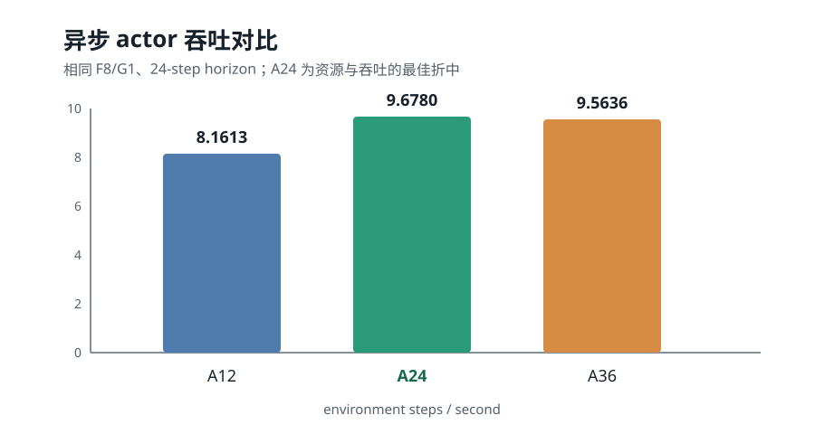

# 力学蛋白强化学习项目周报

**汇报周期：2026-08-10 至 2026-08-14**

## 一、整体研究计划

本项目拟建立“蛋白序列表示、结构突变、局部松弛、力学性能评价、策略优化”一体化的强化学习框架。ESM2 提供变长序列的逐残基表征，DDQN 在残基—氨基酸动作空间中选择突变，PyRosetta 完成局部侧链 repack，基于氢键与拓扑特征的随机森林预测器提供力学性能信号。项目最终目标不是单纯降低 TD loss，而是在未见蛋白上稳定提高预测 strength 和 toughness，并通过结构质量约束减少不合理突变。

## 二、当前阶段

上一阶段已经跑通 12 个 PyRosetta actor、集中式 ESM2 推理和单 GPU learner 的异步流水线，核心训练吞吐较串行版本提升约 2.29 倍。本周工作由“继续提高并发速度”转向“校准优化目标”：一方面确定服务器上的合理 actor 数量，另一方面检查 total reward 是否真正反映力学性能改善，并据此重构 terminal reward、step shaping 和 replay 学习方式。工程链路已具备长时训练能力，但固定验证集上的力学改善仍是下一阶段的关键验收指标。

## 三、本周工作

### 1. 异步训练资源折中

完成 A12、A24、A36 三组异步配置的对比。A36 将 actor 数量扩大三倍，但吞吐仅比 A12 提升约 15%，单 actor episode 延迟由 23.55 s 增至 78.44 s，说明 CPU/NUMA、内存带宽、PyRosetta、ESM2 队列和 IPC 已进入共享资源竞争区间。统一稳态口径下，A12、A24、A36 分别达到 8.1613、9.6780、9.5636 step/s；A24 比 A12 快 18.58%，同时略快于 A36，因此确定 A24 为当前服务器上更合理的资源与吞吐折中，不再继续扩大 actor 数量。

### 2. Reward 与力学目标重新对齐

长时训练表明，旧 total reward 主要由 24 个带正基线的 step reward 构成，terminal reward 平均只占约 -0.49%。策略主要学会减少局部 collision 恶化，而 terminal strength/toughness 没有跨蛋白一致提升。为此，将 terminal reward 改为终态相对初态的标准化力学增量：strength 与 toughness 各占 0.5，并将训练中的静态 source predicted structure 从增量计算中移除，保证 reward 与本 episode 的 PyRosetta terminal pose 对应。短测试确认新 reward、日志字段和 scale 8 配置可正常运行。

### 3. Q-value 高估与训练效果诊断

系统梳理了 Q 高估的来源。当前 online Q 一度达到 79–81，而完整 episode return 约为 15–16；主要原因不是单一 target-sync interval，而是持续正 step reward、缺少剩余步数和结构历史的非充分状态、重复位置突变、bootstrapping 误差以及稀疏 terminal 信号共同作用。仅放大 terminal reward 后，loss、TD error 和 Q 仍保持先升后降，strength delta 仍接近随机正负各半，toughness 仅表现为恶化程度减小。结论是 Bellman 自洽不能替代 Q-return 校准，也不能作为力学性能提升的证据。

### 4. PER、n-step 与弱 shaping 实现

针对上述问题，完成 Ape-X 风格的 TD-error prioritized replay，支持 uniform/prioritized 两种模式，并加入 importance-sampling weight 与 beta 退火。新增可配置 n-step return，异步脚本默认使用 n=3，使 terminal reward 能直接监督最后三个突变动作。step reward 改为零中心：无变化为 0、改善为正、恶化为负，并将 scale 设为 0.025，使 24 步 shaping 的理论绝对上限约为 0.6，低于有意义的 terminal improvement。Replay snapshot、日志、TensorBoard 和测试同步更新；完整测试结果为 130 passed、2 skipped，组合 smoke test 验证了变长状态、PER priority 回写及 3/3/2/1 terminal flush。

## 四、相较上一阶段的变化

上一阶段的主要成果是异步训练框架和端到端加速，本周进一步确认单纯增加 actor 已接近收益上限，研究重点由系统吞吐转向 reward 与策略效果。方法上，从绝对 terminal score 和正基线 one-step uniform replay，推进到 initial-to-final mechanical improvement、零中心弱 shaping、TD-error PER 和 3-step return。结果上，训练数值链路更完整，但已有对照也表明：如果 observation 仍缺少结构历史、探索过早结束，或 predictor 对局部 strength 变化不敏感，继续延长训练并不能自动获得有效的力学优化策略。

## 五、下一步计划

首先建立固定 validation PDB 的 greedy checkpoint 评估，按相同初态报告 strength/toughness delta、improved fraction、top-k 与 Q-versus-realized-return calibration。其次对新 PER+n3 版本进行与 uniform+n1 的同 environment-step 对照，并把 epsilon 衰减从当前 50,000 transitions 延长到约四个 epoch，避免所有 actor 在首个 epoch 前同时失去探索。随后测试禁止重复位置、补充 remaining-step 与 visited mask；若 strength reward 仍无响应，将优先检查随机森林对局部突变的分辨率，而不是继续调整 DDQN loss。
