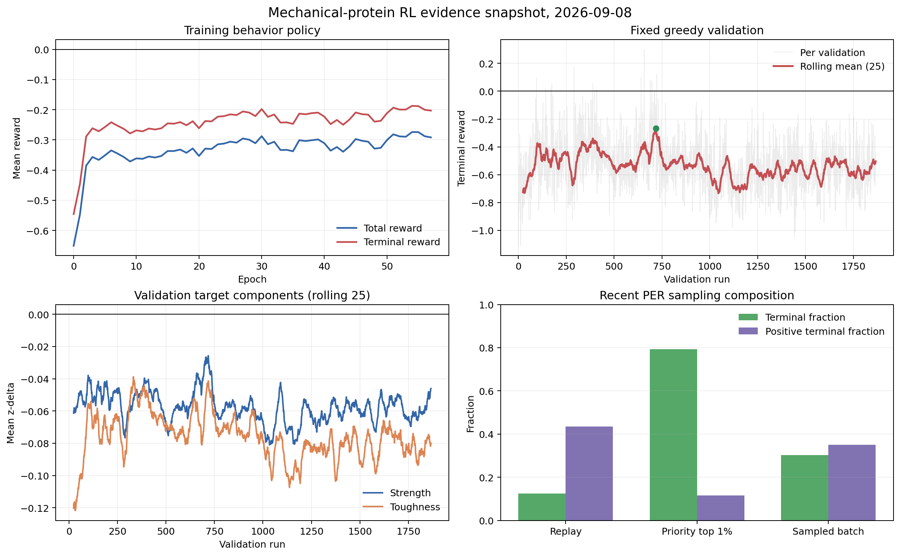

# 力学蛋白强化学习项目阶段周报

**汇报周期：2026-08-18 至 2026-09-08**

## 一、整体研究计划

本项目拟建立“序列表示、结构突变、局部松弛、力学代理评价、强化学习优化”的闭环。ESM2 提供逐残基表征，DDQN 在“残基位置×氨基酸类型”的动作空间中选择突变，PyRosetta 执行局部结构更新，基于氢键与拓扑特征的随机森林预测 strength 和 toughness。最终验收标准不是 loss 或 Q 值下降，而是模型在未见蛋白上相对野生型产生稳定、可复现且经高保真方法验证的力学性能提升。

## 二、当前阶段

上一阶段完成了异步 A24、PER、3-step return、零中心 step reward 和相对初态的 terminal reward，但尚不能区分训练回报改善究竟来自策略学习还是行为分布变化。本阶段重点转向证据体系建设：加入固定贪婪验证和 PER 样本构成诊断，完成一轮接近全量的长期训练；同时补齐进程治理、技术报告和模型推理入口。当前系统已具备稳定训练和批量设计能力，但策略有效性仍未达到进入实验候选筛选的门槛。

## 三、本阶段工作与结果

### 1. 建立独立的策略评价与采样诊断

实现固定 validation PDB、固定 seed、`epsilon=0` 的配对验证。验证 actor 使用冻结策略，结果不进入 replay，也不推进训练步数；TensorBoard 同时记录 strength、toughness、terminal reward 的均值、中位数、正向比例、top-k 和 bootstrap 置信区间。进一步在 replay 全体、priority top 1% 和 sampled batch 三个层面记录终端正负样本构成，从而区分“PER 看见了终端样本”和“PER 学到了正向终端样本”。动作侧启用禁止重复位置，并把 visited mask 纳入 observation，减少循环动作和状态不充分问题。

### 2. 长期训练表现：训练侧改善，固定验证未通过

截至 9 月 8 日，A24 长训练仍正常运行，完成约 448,052/492,864 episodes（90.9%）、10.75M environment steps 和 58 个 epoch，平均吞吐约 6.90 step/s。前5个 epoch 与最近5个完整 epoch 相比，训练行为策略的 total reward 由 -0.461 改善到 -0.283，terminal reward 由 -0.363 改善到 -0.195；改善主要来自 toughness 负向幅度由 -0.085 降至 -0.045，strength 则长期接近零且略负。这说明策略在训练分布中学会减少严重退化，但尚未形成双目标同步提升。

更严格的固定验证给出了不同结论。1867 次验证中，前100次 terminal reward 均值为 -0.584，报告快照后的1097次为 -0.570，最近100次为 -0.564；25次滑动均值的历史最佳值为 -0.268，当前回落至 -0.504。均值置信区间显著高于零的次数仍为0，显著低于零为855次；全程线性斜率约为每100次验证下降0.0056。由此判断，训练侧“少负化”主要受行为策略、蛋白采样和离策略学习分布影响，不能解释为对固定未见蛋白的泛化提升。

最近1万次更新的 loss、绝对 TD error、grad norm 和 Q 均值分别约为 0.0055、0.381、0.030 和 0.137，说明数值训练已经稳定。与此同时，PER priority top 1% 中终端样本占79.3%，但正终端样本仅占11.5%；实际 sampled batch 中终端样本占30.3%，正样本占35.1%。PER 当前主要富集“大幅失败”而非“高价值改善”，因此能够强化失败规避，却难以主动发现稀疏的正向轨迹。这是固定验证长期不转正的主要算法侧解释之一。

### 3. 长任务可靠性与资源代价

清理了5个失去 learner 的孤儿进程组，释放超过100 GiB RSS；随后加入 worker 父进程守卫、Linux parent-death signal、低内存 supervisor、信号转发及 learner 退出码记录。相关生命周期、validation、replay 和 agent 测试达到139 passed、2 skipped。当前作业已连续运行18天，证明治理方案有效。

长期运行也暴露了新的工程成本：learner 当前 RSS 约104 GiB，实际 replay capacity 为100k；`steps.jsonl`、TensorBoard 和 optimization 日志已分别约20.9 GB、14.4 GB 和0.96 GB。后续瓶颈不再只是计算速度，还包括状态存储和过密日志。应保留聚合统计，降低逐 step 持久化频率，并研究 embedding 去重或压缩。

### 4. 形成阶段技术报告并校正研究边界

完成中文技术报告的 Markdown、Word 和 PDF 版本，并生成训练、验证、外部数据和系统架构图。报告将当前优化对象重新界定为“基于氢键网络与拓扑特征的力学代理”，而不是直接实验力学性能。域内随机划分虽具有较高排序相关，但序列长度贡献过高、相似性划分性能下降，MechanoPro 和蜘蛛丝数据的跨域相关较弱。因此，即使 RL 将代理值优化为正，也仍需结构不确定性控制和高保真 SMD/实验复核。

### 5. 完成批量蛋白设计入口

新增 `run_rl.py`，支持从单链 PDB 或 FASTA 文件夹解析序列、加载任意兼容 checkpoint、使用本地 ESM2 逐步贪婪设计，并按 `<原名>_<实际更新次数>.fasta` 输出。真实 checkpoint、PDB、ESM2 的 CPU smoke test 跑通，相关单元测试9项全部通过。针对短序列，将超过长度的更新请求截断到 `L`，避免一个11 aa片段因请求24个不重复突变而终止整个批任务。第三方结构预处理中，478个PDB全部成功解析，其中251个严格大于200 aa，已完成独立归档，为后续长蛋白设计评估准备数据。

## 四、相较上一阶段的认识变化

上一阶段只能说明 PER、n-step 和 reward 重标定降低了 Q、loss 与梯度峰值，并推测需要固定验证。本阶段通过18天长训练验证了这一判断：数值稳定和训练回报改善确实存在，但独立验证未随训练预算增长，甚至在历史最佳窗口后回退。研究问题由“模型是否收敛”进一步收敛为三个可检验问题：奖励空间是否存在足够密度的正动作；ESM2 与 visited mask 是否足以识别结构奖励变化；当前代理提升是否具有真实力学意义。继续无对照延长训练的边际信息增益已经很低。

## 五、下一步计划

当前长训练已完成90%以上，可运行至64 epoch形成完整基线，但不再追加同配置训练预算。完成后冻结最终及代表性 checkpoint，避免从1867次验证中事后挑选最佳模型造成选择偏差。下一步优先对固定PDB进行单点突变全扫描和短束搜索，统计正向动作密度、可达上界及重复重排信噪比；随后开展去长度化代理、随机森林版本统一和不确定性评估。只有确认正向轨迹可达，才比较正负分层 replay、正向样本缓冲区和结构特征增强；批量推理则先在251个长蛋白上完成设计与结构质量过滤，再决定是否进入高成本结构预测和SMD复核。
