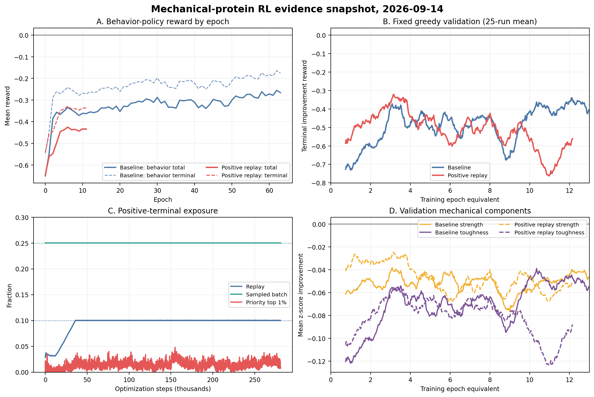

# 力学蛋白强化学习项目周报

**汇报周期：2026-09-09 至 2026-09-14**

## 一、整体研究计划

本项目拟建立“蛋白序列表示、强化学习突变、PyRosetta 局部结构松弛、结构力学代理评价”的闭环。ESM2 提供逐残基状态，DDQN 在“残基位置×氨基酸类型”空间内选择突变；step reward 约束局部结构质量，terminal reward 用氢键与拓扑特征随机森林评价相对初态的 strength/toughness 改善。项目最终目标不是使 TD loss 收敛，而是在固定未见蛋白上得到可复现的正向力学改造，并经结构质量控制、SMD 或实验进一步复核。

## 二、当前阶段

上一阶段已完成异步采样、PER、3-step return、固定 greedy validation、禁止位置重复修改和终端相对增益奖励。结果表明训练过程数值稳定，行为策略 reward 由严重负值逐渐“少负化”，但固定验证仍未转正。本周首先完成 64 epoch 长期基线闭环，然后针对 replay 中正向终端 transition 稀少、absolute TD-error PER 偏向大幅失败的问题，实现正向样本保留与分层采样，并启动同配置新实验。当前研究重点已从“能否稳定训练”转为“什么样的经验分布真正有利于跨蛋白策略改善”。

## 三、本周工作与结果

### 1. 完成 64 epoch 长期基线

A24 基线于 9 月 10 日正常结束，完成 492,864 episodes、11,828,736 environment steps 和 1,478,075 次参数更新，总用时 1,709,840 秒（19.79 天）。训练行为策略的前3个与后3个 epoch 相比，total reward 由 -0.528 提升到 -0.267，terminal reward 由 -0.427 提升到 -0.176，正终端比例由 32.4% 增至 44.0%；主要贡献仍是 toughness 下降幅度由 -0.101 缩小到 -0.042，strength 则始终略低于初态（-0.0059 到 -0.0019）。最后1万次更新的 loss、绝对 TD error、grad norm 分别为 0.0060、0.403、0.028，说明训练稳定，但不等于获得了有效设计策略。

固定 greedy validation 给出更严格的否定证据。前100次与后100次验证的 terminal reward 仅由 -0.584 变为 -0.550；25次滑动均值在第718次验证达到历史最佳 -0.268，训练结束时反而降到 -0.743。末100次 strength 为 -0.063、toughness 为 -0.075，仍未实现任一目标的平均正改善。由此判断，训练侧增长主要反映探索分布中的失败规避，长期追加训练没有转化为稳定泛化，并存在最佳窗口后策略回退的问题。

### 2. 实现正向样本保留与分层 PER

新增 `--positive-sample-fraction`、`--positive-replay-reserve-fraction` 和 `--positive-reward-threshold`。正样本严格定义为携带有限值且 terminal reward 大于阈值的 transition；buffer 满载后保留至少10%的正向终端 transition，batch size 128 时固定抽取32条正样本，其余样本继续在各层内按 absolute TD error 进行 PER。新实现不复制 ESM2 state，replay 快照升级为 v4，同时兼容 v1-v3。比例 smoke test 达到 replay 10%、sampled batch 25%，全仓测试为 152 passed、2 skipped。

### 3. 新实验的多层证据分析

截至 9 月 14 日上午，新实验完成 93,746 episodes（12.2 epoch）、约2.25M environment steps 和280,750次更新，累计吞吐 6.64 step/s，已接近旧基线的6.92 step/s。buffer 刚满载后累计吞吐曾在200k steps降至3.19 step/s，随后持续恢复，因此暂不能把短时下降归因于分层采样的稳定开销。replay 正样本比例稳定为10.01%，sampled batch 稳定为25.00%，说明采样机制准确生效；但 priority top 1% 中正向终端样本仅1.68%，进一步证实最大 TD error 仍主要来自失败轨迹。

机制生效尚未带来策略收益。在相同前93,746个 episodes 内，新方案的行为 total/terminal reward 为 -0.478/-0.379，旧方案为 -0.398/-0.303，正终端比例也由旧方案38.6%降至34.4%。相同前391次固定验证中，新旧 terminal reward 分别为 -0.520 和 -0.497；最近100次分别为 -0.621 和 -0.401。差异主要来自新方案 validation toughness 恶化至 -0.101，而旧方案同期为 -0.050。新方案曾在第101次验证达到25次滑动均值 -0.321，随后回落到 -0.561，尚无持续改善趋势。两组虽使用相同 seed 和训练预算，但异步调度使实际经验顺序不完全一致，因此当前结论属于单 seed 同预算对照，仍需短预算多 seed 复核。

### 4. 当前结论与原因判断

本周完成的是“正向经验可被保存并稳定进入 batch”，但数据不支持“提高正样本比例即可提高策略”。可能原因有三点：第一，terminal reward 大于0只表示代理模型的一次正预测，可能包含结构松弛噪声和随机幸运样本；第二，3-step 只把终端结果传播到最后几个 transition，25%的配额可能反复采到同一成功 episode 的相关尾部片段，无法学习前段决策；第三，当前 importance weight 只校正层内 PER，不校正人为层间配额，过强的25%固定配额可能改变 Bellman 训练分布。结果也说明问题不只是“正样本数量不足”，还涉及正样本质量、轨迹级 credit assignment 和状态对结构奖励的可辨识性。

工程侧，完整基线目录达到51 GB并产生2,054个 agent checkpoint；新实验运行12个 epoch 已占9.6 GB。若不调整保留策略，完整实验仍会接近50 GB。后续应减少中间 checkpoint，仅保留阶段节点、validation 最优和最终模型。

## 四、相较上次周报的认识变化

上次周报只能根据90.9%的基线快照判断“训练改善、验证未通过”，并提出提高正向样本曝光。本周得到两项更明确的结果：其一，基线完整运行到64 epoch后依然没有泛化转正，末期验证还明显回退，因此训练预算不是当前主要瓶颈；其二，正向 transition 的存储和采样比例提高约2倍和4.6倍后，早期策略反而弱于同预算基线。由此将假设从“PER 看不到足够正样本”修正为“PER 看到了正样本，但这些样本是否可靠、独立且可归因尚未解决”。

## 五、下一步计划

先将当前实验运行到预设的16-epoch判断点；若最近100次固定验证仍未恢复到同期基线，则停止长训练并冻结代表性 checkpoint。下一步开展三组短预算消融：仅保留、仅分层采样、保留加分层，并使用相同初始权重和至少3个 seed。正样本标准从 `reward>0` 提高为“超过噪声阈值或重复松弛后下置信界大于0”，同时按 episode 去重，比较10%、15%、25%采样比例。并行开展固定蛋白单点突变扫描，估计正动作密度、strength/toughness 可达上界及代理重复性；若正动作本身稀少或不可辨识，应优先改进 reward predictor 与结构状态，而不是继续调整 replay 比例。
